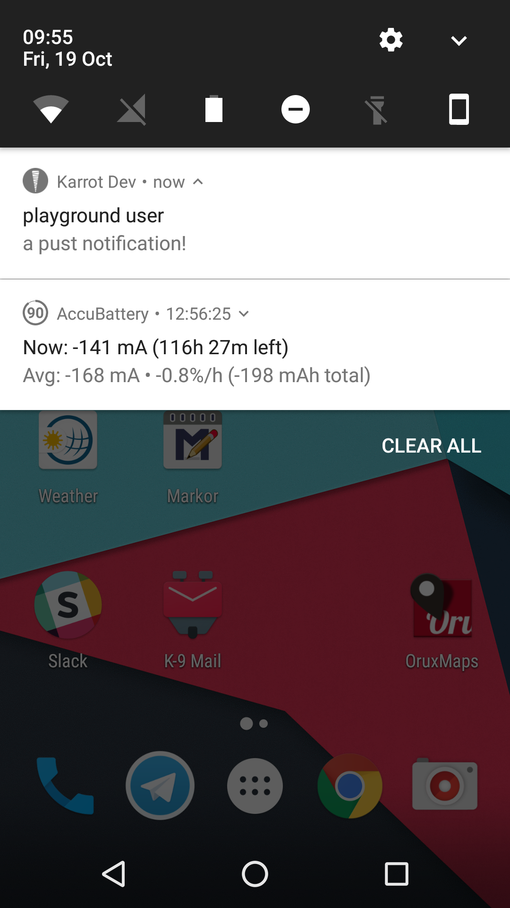
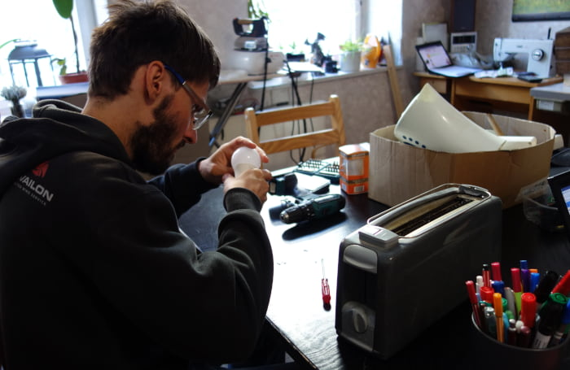
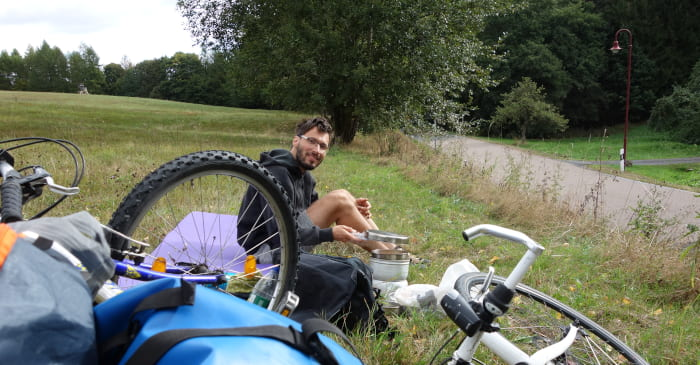
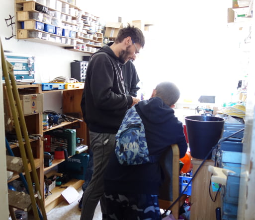

**The yunity heartbeat** - news from the world of sharing, fresh every two weeks.

## [Kanthaus](https://kanthaus.online)
The [Oya published an article](https://oya-online.de/article/read/3039-.html) about projects in Germany that offer free spaces and thus enable people to discover their own motivations. We're happy that they mentioned Kanthaus, too!

We have a new blog post about all things foodsharing that happen in our house: The local activities as well as the regional, national and international ones. Read it up by clicking [here](https://kanthaus.online/blog/2018-09-26_foodsharing)!

The meeting to review the festival season from a foodsharing point of view took place over the last weekend. All organizers who led groups of foodsavers on different music festivals (such as Hurricane, Fusion, Feel and many more) were invited and a group of 12 met up at Kanthaus. We discussed the mission of foodsharing on festivals (raising awareness for food waste & hands-on foodsaving on camp grounds and from food stands), the scope of the working group, who is responsible for what and how we can even improve an already well-rehearsed work flow.

 
_The foodsavers at the Hurricane festival in June 2018_

_by Janina_

## [Karrot](https://karrot.world)

*No big changes, but ongoing progress.* With 64 commits since the last heartbeat on 2018-09-30, the focus lies on small improvements, bug fixes and improvements to the development workflow.

There's a new type of notification if the connection to the server has been lost, to make it more visible to the user. It also allow us to react in certain ways, for example refreshing data after the connection has been restored.

App push notifications have been fixed and the tray icon for Android has been replaced with one that resembles a carrot more closely (before, it looked like a bomb). Scrolling and focus behavior for message input on mobile clients has been improved, trying to keep the cursor on screen when the touch keyboard opens.

 
_Push message on Android with a new monochrome logo_

Updated locales are now automatically checked and a Pull Request will be created in the Github repositories if there are updates from transifex. The release process of the Karrot App to the Play Store has been further automated, now also synchronizing description text and pictures.

For more details, have a look in [our changelog](https://github.com/yunity/karrot-frontend/blob/master/CHANGELOG.md)!

_by Tilmann_

## [Harzgerode / Haus X](http://freiefeldlage.de/)
On our way to Wurzen last week Anna, Bodhi and I stopped for one day in Harzgerode and brought the greatest competitor for Steffen in being our HausX multitalent. An oven. But what kind? This oven has a window, so you can sit in front of it, enjoy the warmth and watch the flames inside – an activity which is definitely one of my favorite activities in wintertime. In addition it heats water which will be used for the heating system in the ground floor and on top… (dramatical pause) …there is...the possibility...to….BAKE! Woaaah! Isn‘t that a reason to spent some winter weeks in HausX?!

 
_It's an oven in every sense of the word!_

This and the fact that after the last building week there is now a cozy loft bed in the office, a lounge with comfortable armchairs beside the kitchen, a new communal sleeping room and beautifully drawn signs all around the house, which really make HausX a nice place to be.

_by Lise_

## [foodsaving worldwide](https://foodsaving.world)

## [foodsharing.de](https://foodsharing.de)
It has been two months now, that I did my last [commit](https://en.wikipedia.org/wiki/Commit_(version_control)) to foodsharing.de, still there are 23 entries in the Changelog since then.

Wait... Who else did them?

Can it...?

Yep!

There is actually 9 contributors other than me who did changes to foodsharing in the last two months!
Amazing!

And not only that.

A small group of people started creating an Android app, I heard.

So I checked the repository just now and was able to download a working [apk](https://en.wikipedia.org/wiki/Android_application_package) which I could install on my phone, log into foodsharing and see my messages.

Nice!

Okay, you might say that our foodsharing light approach nearly two years ago reached the same state, but I see much more momentum in the current approach.

I see 3-4 people contributing to the new app, while all of them are also doing necessary changes and additions to the running foodsharing.de backend.

I am really glad about the recent developments and hope that I will soon find time and motivation to jump back to foodsharing development again :-)

At least if other foodsharing responsibilities don't take all the time I am willing to spend. (Short forecast: We will change our internal email addresses soon, details will be published once they are known)

I put random pictures like this one above of me doing other things in the article to proof that I really did not do anything on foodsharing.de in the last two months.

_by Matthias_

## About the heartbeat.
The heartbeat is a fortnightly summary of what happens in yunity. It is meant to give an overview over our currents actions and topics.

### How to contribute?
Talk to us in [#heartbeat](https://yunity.slack.com/messages/heartbeat/) on [Slack](https://slackin.yunity.org) if you want to add content, change the layout or any other heartbeat related issues and ideas! We are also happy about any kind of feedback! ^\_^
