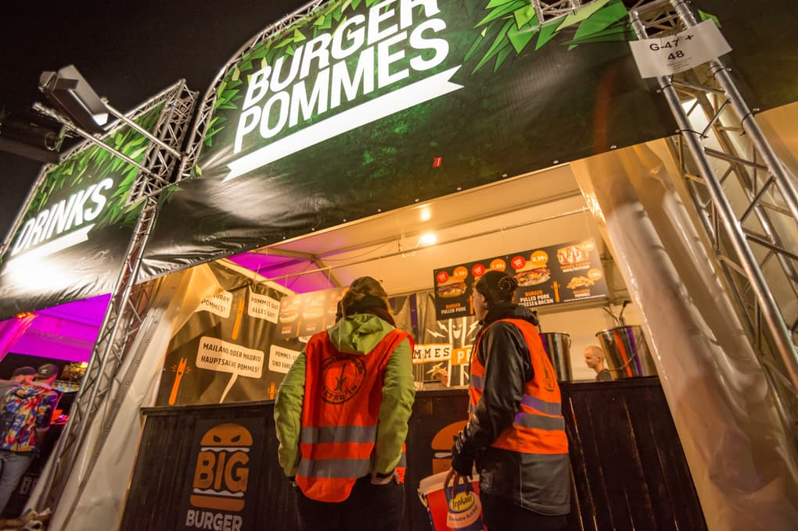

**The yunity heartbeat** - news from the world of sharing, fresh every two weeks.

## [Kanthaus](https://kanthaus.online)
The [Oya published an article](https://oya-online.de/article/read/3039-.html) about projects in Germany that offer free spaces and thus enable people to discover their own motivations. We're happy that they mentioned Kanthaus, too!

We have a new blog post about all things foodsharing that happen in our house: The local activities as well as the regional, national and international ones. Read it up by clicking [here](https://kanthaus.online/blog/2018-09-26_foodsharing)!

The meeting to review the festival season from a foodsharing point of view took place over the last weekend. All organizers who led groups of foodsavers on different music festivals (such as Hurricane, Fusion, Feel and many more) were invited and a group of 12 met up at Kanthaus. We discussed the mission of foodsharing on festivals (raising awareness for food waste & hands-on foodsaving on camp grounds and from food stands), the scope of the working group, who is responsible for what and how we can even improve an already well-rehearsed work flow.

_The foodsavers at the Hurricane festival in June 2018_

_by Janina_

## [Karrot](https://karrot.world)

## [foodsaving worldwide](https://foodsaving.world)

## [foodsharing.de](https://foodsharing.de)

## [Harzgerode / Haus X](http://freiefeldlage.de/)

## About the heartbeat.
The heartbeat is a fortnightly summary of what happens in yunity. It is meant to give an overview over our currents actions and topics.

### How to contribute?
Talk to us in [#heartbeat](https://yunity.slack.com/messages/heartbeat/) on [Slack](https://slackin.yunity.org) if you want to add content, change the layout or any other heartbeat related issues and ideas! We are also happy about any kind of feedback! ^\_^
