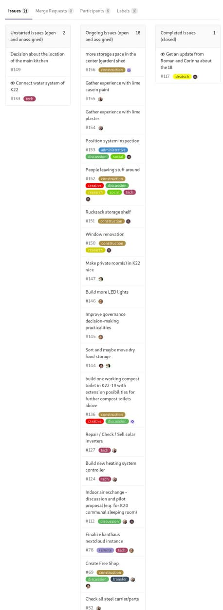
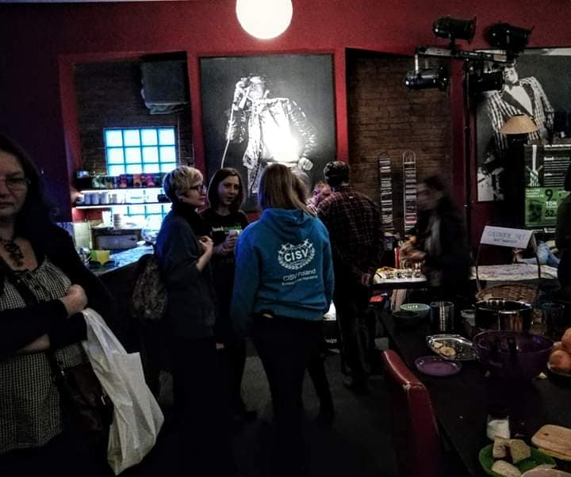
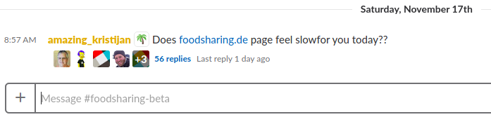
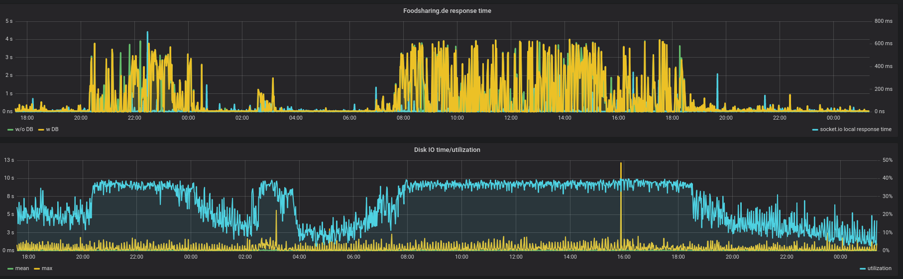
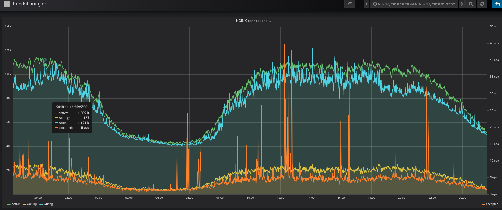
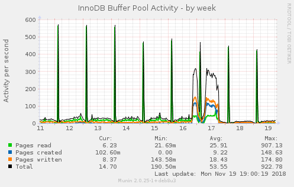

**The yunity heartbeat** - news from the world of sharing, fresh every two weeks.

## [Kanthaus](https://kanthaus.online)
Kanthaus is still occupied with room planning. On coming Wednesday we will hold the third bigger meeting on the topic to clarify the obvious questions:
- What is the big, long-term masterplan for the layout of Kanthaus we all can agree on?
- What are the obstacles we need to overcome to make it reality?
- What steps towards these goals can be taken right now?

On top of that our [Autumn Roadmap](https://kanthaus.online/governance/minutes/2018-09-04_roadmap) is coming to an end, which means that we are closing in on a planning phase for winter anyways – so what's a better time for dreaming? :)

<br>
_As you can see we still have some things to do..._

Fitting to the topic of dreaming, I'm happy to announce that Alexandra Yepes, a filmmaker who recently started shooting "[a documentary about life outside of the monetary system, produced entirely under the sharing economy](https://chirimoyafilms.wixsite.com/fausto/)", will come to Kanthaus next weekend. She is mostly following her protagonist Fausto, but will of course also record some of what is going on in Kanthaus. (Unfortunately that won't be a lot during the time she'll be here... ^\_^')

_by Janina_

## [Foodsaving Worldwide](https://foodsaving.world)
Lódź celebrated the 1 year anniversary of their Food-Share Point last week with [a big event](https://www.facebook.com/events/256984375161501/). They also gave an [interview in a radio show](https://www.radiolodz.pl/broadcast_posts/48304-pierwsze-urodziny-lodzkiej-jadlodzielni-jestem-eko) (all in Polish, but a summary in English will follow shortly!), in which they showed a much brighter attitude than [during our visit in September](https://foodsaving.today/en/blog/2018/10/18/fspl-lodz-wroclaw).

<br>
_An impression from the anniversary party in Lódź_

In Germany there is a lot of work done right now to strengthen the voice of foodsharing in media, politics and education: Next week there will be the [first session of the newfound "foodsharing academy"](https://wiki.foodsharing.de/images/6/6f/Seminarausschreibung_final.pdf) in Kassel, where foodsavers can learn about how to educate others about issues related to food waste. And until the end of the year the [demands for Germany's politicians](https://wiki.foodsharing.de/images/c/c6/Forderugen_lang_2017-12.pdf) will be refined, renewed and represented towards the public.

_by Janina_

## [Karrot](https://karrot.world)

Last heartbeat missed a Karrot contribution, so this one highlights activity since end of October:

- We scheduled our [winter roadmap](https://community.foodsaving.world/t/collecting-feature-requests-for-karrot-winter-2018/134/8?u=tiltec)
- 120 commits touching 15,000 lines of code
- [4 new releases](https://github.com/yunity/karrot-frontend/blob/master/CHANGELOG.md)
- significant improvements to the [Android app](https://play.google.com/store/apps/details?id=world.karrot)
- the frontend code is now [organized in modules](https://docs.karrot.world/frontend-structure.html)

<br>
_The new splash screen when loading Karrot; it makes Tilmann happy every time he improves the code_

There was also some Karrot-related activity in the [community forum](https://community.foodsaving.world/):

- Janina wrote a [call for beta testers](https://community.foodsaving.world/t/call-for-beta-testers/144)
- Lukas started a discussion about a [funding concept for Karrot](https://community.foodsaving.world/t/funding-concept-for-karrot/136)
- Bruno shared [his ideas how to send less emails](https://community.foodsaving.world/t/improving-notifications-e-mail-and-push/169)


_by Tilmann_

## Foodsavin today

## [foodsharing.de](https://foodsharing.de)-dev
Saturday afternoon, 15:10, I wanted to do a little bit more foodsharing development again, because there is this really important Emailtopic coming soon...
So, as I open Slack to talk to other people about what I am up to, I see:

<br>

Oops, what is this?

<br>

Yep, they seem right, something wrong here! What is going on? Maybe media coverage, an attack or something?

<br>

I cannot spot any great difference here. For sure, I also checked [top](https://en.wikipedia.org/wiki/Top_(software)) on the server itself, not showing any suspicious processes using CPU. But I see a high IO load and [MySQL](https://en.wikipedia.org/wiki/MySQL) being responsible for a lot of everything. What does our monitoring say about that?

<br>

(Different time scale here - Evening of the 16th up to the 17th is the time we are talking about; the regular peaks is the daily backup)

Wow, this does not seem right. So I dived into our SQL activity a bit and did not find anything unusual. I learned about `SHOW ENGINE INNODB STATUS`, which gives a lot of information about what the database is doing (and has been doing in the last few seconds). I learned about the global log, which can log all queries happening, even to a database that can be queried and analysed with [phpMyAdmin](https://www.phpmyadmin.net/) (which so far is the only database administration tool we use).
I played around with an increased buffer pool and sort buffer (as I know we have a bunch of queries that could use some optimisation). I expected some query to have jumped above a certain result size and not fitting into some buffer anymore. I still don't know if I am right.

In the end, some traces were pointing me towards innocent looking queries of this type:

```
UPDATE `fs_foodsaver_has_bell` SET `seen` = 1 WHERE `bell_id` IN (1369457,1369000,1357929,1357286);
```

This marks your notification (somebody answered your post, a new store in your area is created, ...) as read and happens quite often: Lazily, whenever you see notifications.

So, as this query runs very often and - as a write command - is IO intense, what happens when we disable it?

The answer is already in the graphs you see above. I am sorry for your notifications staying unread for now...
It is 18:35 and my computer time for that saturday is over.

Fortunately, I opened the [important issue about the emailing](https://gitlab.com/foodsharing-dev/foodsharing/issues/385) already early while I was digging into the issue described above, otherwise I would not even have done what I absolutely wanted to...

Some facts of this story where gathered just when I did this writeup, but it happened approximately as written. I shared this with you to show how life of a combined sysadmin/developer/project manager looks like and I seldomly end up doing in my time what I actually planned for.
The unfortunate thing here is that the solution currently implemented needs to be revised. I hotfixed it in the production deployment, there is no answer yet to what actually caused this problem, not even clarity, that I "fixed" the actual bad query...

In a developer constrained project like foodsharing.de, quirks like this will always be a part of, we just have to take care, that they don't come back to us and that we try to do them as properly as possible :-)

_by Matthias_

## [Harzgerode / Haus X](http://freiefeldlage.de/)
Since yesterday the project in Harzgerode is way Way WAY more likely to keep existing in the next year(s).
On saturday five people (Mareike, Josi, Theo, Julia, Steffen) founded the Genossenschaft “in der Heilstätte Harzgerode eG” i.Gr. wich is the biggest prerequisite for soonly buying the whole property and bring it into communal ownership of its inhabitants. This is a big milestone.
Meanwhile the winter has arrived and the heating construction takes priority no 1. (deja vu? :wink: )
At least the livign room in HausX is comfortably warm due to the woodstove. Replacing this small stove with a bigger water carrying one wich is capable to make the whole house cozy is paused until the heating in the main buildign is online.

_by Steffen_


## About the heartbeat.
The heartbeat is a fortnightly summary of what happens in yunity. It is meant to give an overview over our currents actions and topics.

### How to contribute?
Talk to us in [#heartbeat](https://yunity.slack.com/messages/heartbeat/) on [Slack](https://slackin.yunity.org) if you want to add content, change the layout or any other heartbeat related issues and ideas! We are also happy about any kind of feedback! ^\_^
