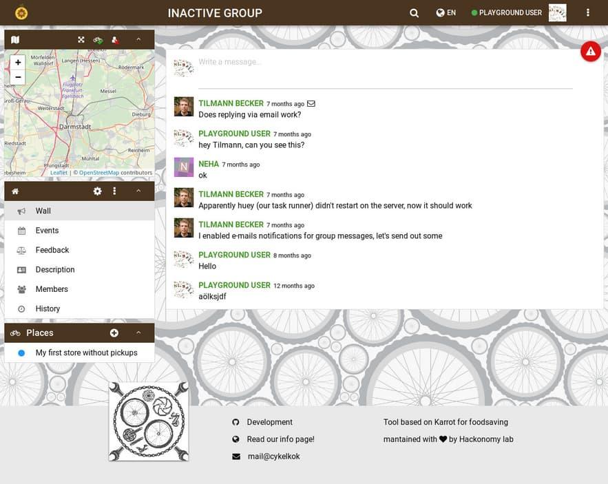
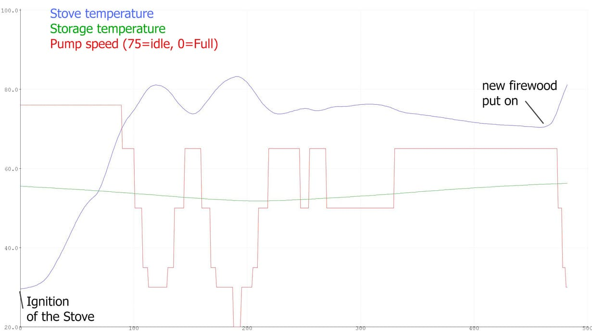
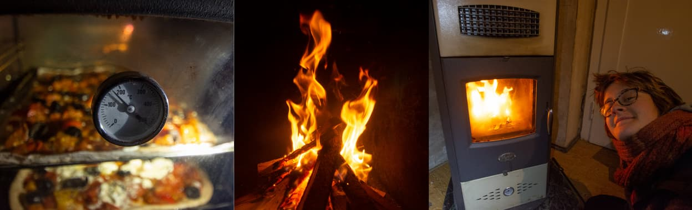
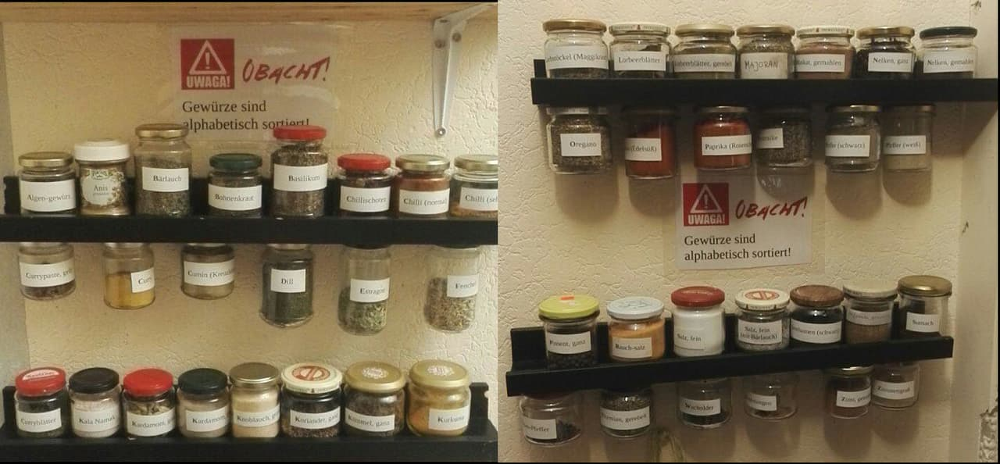

**The yunity heartbeat** - news from the world of sharing, fresh every two weeks.

## [Karrot](https://karrot.world)

[New Karrot release](https://github.com/yunity/karrot-frontend/blob/master/CHANGELOG.md#627---2018-11-28) with improvements for Android app, it should have less problems going to the right page when the user taps on push notifications. The way how it refreshes data has been slightly improved and should cause less failures.

Tilmann and Janina [discussed changes to recurring pickups](https://community.foodsaving.world/t/better-change-handling-for-recurring-pickups/174) in the community forum. The current implementation has problems with more advanced use cases, for example moving pickups around that are part of a series. We're looking for ways to change that without breaking other use cases. Tricky business!

Nick [enabled a stricter Content Security Policy](https://github.com/yunity/yuca/pull/16) for dev.karrot.world. It tries to make sure that no unexpected code is being executed in the browser and no data from insecure connections are being loaded, for example images from non-https connections that users embedded in their custom descriptions. We'll continue to test this on our development site and eventually deploy it to karrot.world too.

Bruno [reported from the Bike Kitchen trial](https://community.foodsaving.world/t/test-karrot-for-bike-kitchen/120/10) with positive feedback and feature suggestions. A store wall and store subscriptions would be especially helpful for them.

 
_How Karrot could look like in bike kitchen mode_

What's up next?
There might be more Karrot coding activity in the next weeks. We are also looking forward to holding a talk about Karrot and related topics at the end of December at [35C3](https://events.ccc.de/2018/09/11/35c3-call-for-participation-and-submission-guidelines/), an international congress held at Leipzig. Finally, there will be a _Winter of Karrot_ at Kanthaus in January - stay tuned!

_by Tilmann_

## [Harzgerode / Haus X](http://freiefeldlage.de/)
Good news! The times when Harzgerode and bone-chilling cold was practically the same thing are finally over. Haus X’s woodstove based heating system designed by Matthias and Steffen is online and perfectly doing its job. By now there are two heated rooms and the modular system can be expanded throughout the whole ground floor. Steffen is obsessed with the thrill of [arduino](https://www.arduino.cc/) stuff to make this the smartest woodstove ever! ;)

 
_Some sensors, some programming and tadaa: Smartstove!_

Anna is still happy about the woodstove's built-in oven and can’t stop baking pizza for everyone. Josi tries to set a time record in not taking off her pajamas.. By now the score is one day... but she is shivering (well, that is a contradiction to the first sentence), because we don’t want to use too much firewood and usually keep the room temperature between 15 and 18°C. Anna saved us a reverse osmosis device to get our self-sufficient water supply. Anyone fancy experimenting with it and getting it running?

 
_Pizza, fire and a happy Josi - that's what's needed in winter_

In the main building a big milestone of the heating system is conquered: The gas line is finally welded (after waiting almost a whole year) so the chances to have a warm house for the new year are growing steadily.

In two weeks the MOVE utopia orga team will join us for one weekend to plan next year's festival.

_by Steffen_

## [Kanthaus](https://kanthaus.online)
Things that happened at Kanthaus:

The workshop was moved to K22 and connected to this a separation in to workshop and electronics workshop took place (not yet complete, so pictures will follow).

We had another room planing meeting that was very well prepared by Chandi and Janina and now we have the ultimate plan of the house that will surpass all time! Or in other words: We now have a rough draft of how the house could look if everything we imagine to change now would actually be combined and in place! We also now have a final more mid range plan that somehow turned into consensus in the last weeks and brought some clarity to the room situation.

And last but not least the spice shelves have been alphabetically sorted and the the jars dualiformed (we didn't have enough small jars of one size to uniform).

_by Bodhi_

## [Foodsaving Worldwide](https://foodsaving.world)
- The summary of foodsharing Łódź's radio interview we promised [in the last issue](http://localhost:8000/en/heartbeat/2018-11-18) now is a [new article on foodsaving.today](https://foodsaving.today/en/blog/2018/11/23/fspl-radio) thanks to Nathalie.
- foodsharing Östersund gains more and more members and was able to secure a fruitful cooperation with a local supermarket.
- There's a new foodsaving enthusiast in Paris, who is ready to put a lot of energy into building a movement in the French capital.
- The food waste researcher [Héctor Barco Cobalea](https://energia.deusto.es/people/members/hector-barco-cobalea/projects/) (who basically is Janina's pen-pal) will soon be part of a EU program against food waste, where he will probably be able to progress our agenda to get more and better data on the actual amounts that are wasted at all levels of the supply chain today.

_by Janina_

## About the heartbeat.
The heartbeat is a fortnightly summary of what happens in yunity. It is meant to give an overview over our currents actions and topics.

### How to contribute?
Talk to us in [#heartbeat](https://yunity.slack.com/messages/heartbeat/) on [Slack](https://slackin.yunity.org) if you want to add content, change the layout or any other heartbeat related issues and ideas! We are also happy about any kind of feedback! ^\_^
