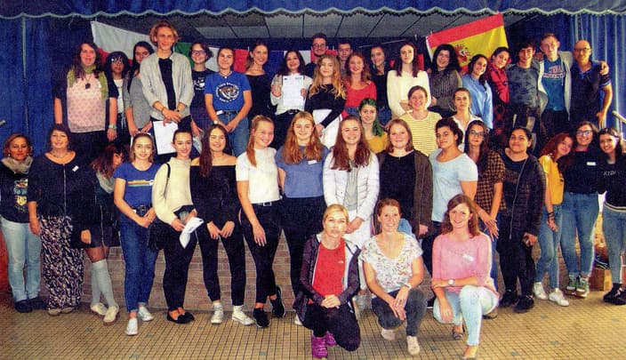
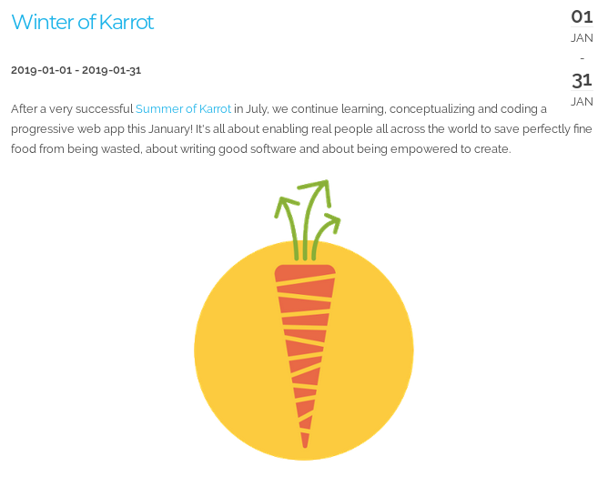
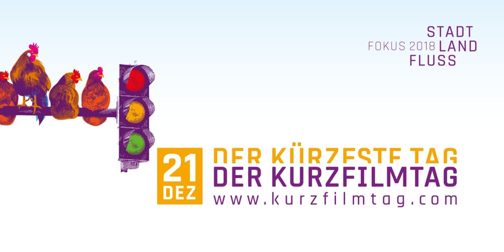

**The yunity heartbeat** - news from the world of sharing, fresh every two weeks.

## [Foodsaving Worldwide](https://foodsaving.world)

An very long and detailed [article about foodsaving](https://mediamax.am/am/news/special-report/31179/) has been published in the Armenian magazine mediamax. It's about how foodsharing rescues huge amounts of food in Berlin and how this method could potentially be applied in Armenia as well. The author Amalie Khachatryan expressed motivation in starting a foodsharing group in the Armenian capital Yerevan as well.

Deliah from Genève informed us about the creation of a 2nd group on Karrot - this time for Lausanne. This is due to a restaurant chain foodsharing Genève cooperates with opening a new branch in Lausanne as well and - of course - wanting to also cooperate with foodsharing there.

Deniz from Bielefeld wrote us in the context of a European youth program about food waste: [Our European super meal](http://our-european-super-meal.de/) is about finding out how the future of food could look like. For this, pupils from 5 different countries - Spain, Italy, France, Poland and Germany - come together to explore different related topics like packaging, production, retail. In [this German press article](http://our-european-super-meal.de/wp-content/uploads/2018/05/IMG_7577-1.jpg) from the very beginning of the project they already realized that 'marketing is the enemy of sustainability', so it seems to be a good project... ;)
For the next phase, Deniz and the others will meet up in Poland and learn about alternatives to waste management. That's why he's interested in foodsharing and already a fan! ^\_^

_Some of the pupils involved - here in a French lycée_

_by Janina_

## [Karrot](https://karrot.world)

The [small release on 2018-12-11](https://github.com/yunity/karrot-frontend/blob/master/CHANGELOG.md#629---2018-12-12) contains mostly bug fixes. Janina added an info button about inactive group members to the member list.

During the last two weeks, Tilmann has been steadily working on improvements to pickup series changes. [It turned out quite different](https://github.com/yunity/karrot-backend/pull/591) than [how it was originally planned](https://community.foodsaving.world/t/better-change-handling-for-recurring-pickups/174). Then main problem was recurring pickups that got individually moved. It's quite complex to properly support them, so even though this feature is used from time to time it seems best to disallow moving pickups which are part of a series (at least until we have more developers). The recommended way will be to use the new "disable pickup" feature on the original time and create a one-time pickup at new time.

The Karrot talk at 35C3 [has been scheduled for 2018-12-29 22:50](https://fahrplan.events.ccc.de/congress/2018/Fahrplan/events/9882.html), so we're getting prepared for a late-night session on foodsaving, cooperative structures and open source software. Our slides are still a bit meager, but Janina did a good job pushing it... and it's only a few days left!

_The upcoming Winter of Karrot sevent on kanthaus.online_

The _Winter of Karrot_ now has a [brief entry](https://kanthaus.online/en/events/2019-01-01_winter-of-karrot) on the Kanthaus event page. We received confirmation from Tais that she will definitely attend. That makes the team from summer complete and we're looking forward to the beginning of January for getting started!

_by Tilmann_

## [Harzgerode / Haus X](http://freiefeldlage.de/)

Over the last weekend a small but hardy crew met in Harzgerode to continue planning next year's [Move Utopia](https://move-utopia.de/). With an abundance of saved food and a new oven in the Inspektorenhaus it was easy to feel at home in the snowy winter wonderland that is the Harz mountains right now.

_by Silvan_

## [Kanthaus](https://kanthaus.online)

Kanthaus is becoming more and more culturally interested and interesting! 

Lise and Janina are already part of [Wurzen's women's choir](http://www.wurzener-frauenchor.de/) and attended their big annual concert at [Kulturhaus Schweizergarten](https://www.wurzen.de/freizeit/freizeiteinrichtungen/kulturhaus-schweizergarten/) to help out and enjoy the show. Next year they'll very well be up on stage together with the Saxon ladies! ^\_^

_Not long until our first real cultural event!_

Next Friday is the shortest day of the year and this is celebrated in all of Germany by holding a [short film festival](https://kurzfilmtag.com/). Together with [Schweizerhaus Püchau](https://schweizerhaus-puechau.jimdo.com/) we will screen short movies of all kinds and for all audiences in the [Laden](https://schweizerhaus-puechau.jimdo.com/der-laden/).
This might very well be the starting point for us organizing more cultural events in Wurzen. Next up maybe a Poetry Slam at Kulturhaus Schweizergarten?

_by Silvan & Janina_

## About the heartbeat.
The heartbeat is a fortnightly summary of what happens in yunity. It is meant to give an overview over our currents actions and topics.

### How to contribute?
Talk to us in [#heartbeat](https://yunity.slack.com/messages/heartbeat/) on [Slack](https://slackin.yunity.org) if you want to add content, change the layout or any other heartbeat related issues and ideas! We are also happy about any kind of feedback! ^\_^
