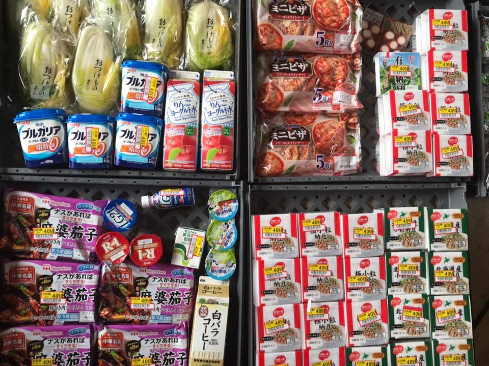

**The yunity heartbeat** - news from the world of sharing, fresh every two weeks.

## [35C3](https://events.ccc.de/congress/2018/wiki/index.php/Main_Page)
Some people anticipate Christmas, other (more nerdy) people celebrate _the Congress_ and this year we joined the latter category! ;)

Basically all of Kanthaus moved their center of activities to [Leipzig Messe](https://en.wikipedia.org/wiki/Leipzig_Trade_Fair) from December 26 to 30. We had our very own base (also called assembly) where we could inform interested people about the various projects we work on.

 
_Our assembly for foodsharing.de / Kanthaus / Karrot / Foodsaving Worldwide / everything that happens in Kanthaus_

Matthias held a [selforganized session about foodsharing.de development](https://events.ccc.de/congress/2018/wiki/index.php/Session:Foodsharing.de_call_for_web_developers) and managed to motivate some people to get involved. Doug did a lot of networking with tons of people and was quite exhausted from all the talking after a day already. Silvan and Chandi hosted [three Acroyoga jams](https://events.ccc.de/congress/2018/wiki/index.php/Session:AcroYoga) and Silvan was probably the most appreciative of all of us when it came to the gorgeous visuals of the assembly spaces and the whole fair ground.

 
_A palm made from dome pieces, tube and colorful lights_

 
_A sandbox with projected landscape that changes based on the height of the hills and actual flowing 'water'_

On Day 3 (also called December 29) Nick, Janina and Tilmann held a talk about the foodsaving grassroots movement and how cooperative online structures can facilitate sustainable offline activism. It was part of the official schedule and [here you can still watch it online](https://media.ccc.de/v/35c3-9882-the_foodsaving_grassroots_movement).

 
_The Karrot team on stage_

_by Janina_

## [Karrot](https://karrot.world)

Some days after 35C3, the [Winter of Karrot](https://kanthaus.online/de/events/2019-01-01_winter-of-karrot) started. We quickly decided that we want to work on a tool for conflict resolution in groups, which should also allow user removal based on conversations and voting. Our team of 4 spent some days discussing and planning the feature. You can read more about the [current proposal on our forum](https://community.foodsaving.world/t/conflict-resolution-with-possibility-to-remove-user-from-group/201). Our plan is to implement this feature during the next weeks.

The changes to pickups and recurring pickups are now documented in [a forum post](https://community.foodsaving.world/t/pickups-refreshed/199), can be tested on [dev.karrot.world](https://dev.karrot.world) and will be released into production next week.

Bruno and Tomasz from Gothenburg involved us more in the project to use Karrot for organizing the work of a bike kitchen. A bike bitchen operates in the way that it saves bike parts from trash and reuses them to build new bikes. We think it's a great project, and we're happy to be part of this. The goal is to generalize Karrot beyond food saving and adapt it to bike kitchen structures.

_by Tilmann_

## [Foodsaving Worldwide](https://foodsaving.world)
A new person emerged from the past and is interested in foodsharing Paris. Now it's already three and they got connected! Let's hope for the best and maybe soon we'll have a new foodsaving group in the French capital! :D

We also received mail from an experienced German foodsaver who is moving to Malta and is interested in importing the concept of foodsharing, too. As we all know this often is a pretty solid recipe for success if her motivation stays high for a while... ;)

[Foodsharing Japan](https://www.facebook.com/%E3%83%95%E3%83%BC%E3%83%89%E3%82%B7%E3%82%A7%E3%82%A2%E3%83%AA%E3%83%B3%E3%82%B0%E3%82%B8%E3%83%A3%E3%83%91%E3%83%B3-Foodsharing-Japan-2014852785397936/) is continouusly savong food every week for months now. The pictures they publish on facebook indicate a growing amount of food that is saved and distributed to people who can make use of it. Keep up the good work, guys!

 
_A small portion of the food saved in December in Japan_

_by Janina_

## [Kanthaus](https://kanthaus.online)
Many people gathered in Kanthaus to celebrate the second version of wuwita - the 'Wurzen winter days' - and started the new year in a calm, communal and cozy way. There were some workshops and skill sharing sessions, some games and music and of course a lot of good conversations and amazing food. We did not advertize this event at all, because we really wanted it to be a small gathering of friends. Still, the interest was so high that in the end we were more than 20 people anyways...^^

_by Janina_

## About the heartbeat.
The heartbeat is a fortnightly summary of what happens in yunity. It is meant to give an overview over our currents actions and topics.

### How to contribute?
Talk to us in [#heartbeat](https://yunity.slack.com/messages/heartbeat/) on [Slack](https://slackin.yunity.org) if you want to add content, change the layout or any other heartbeat related issues and ideas! We are also happy about any kind of feedback! ^\_^
