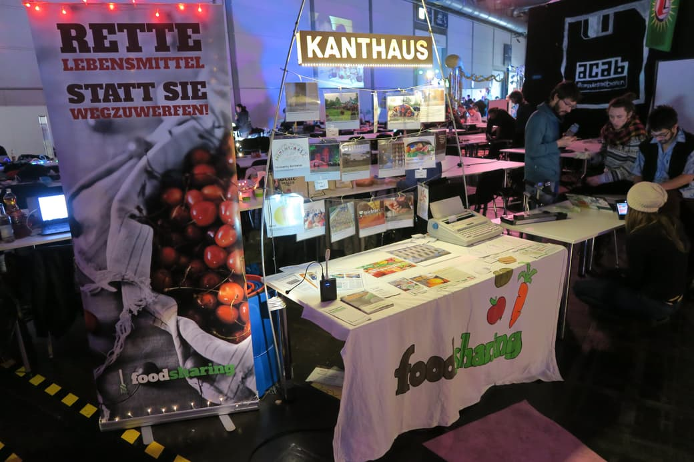
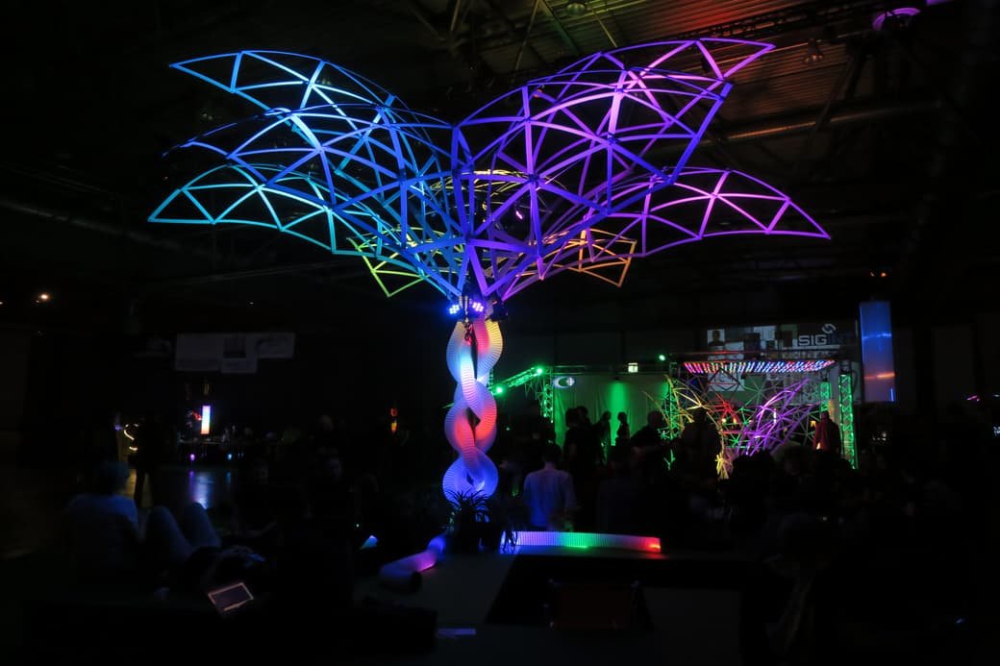
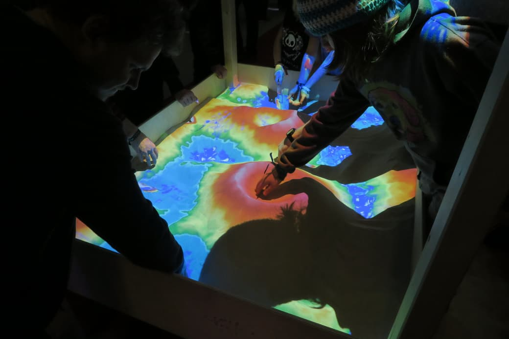
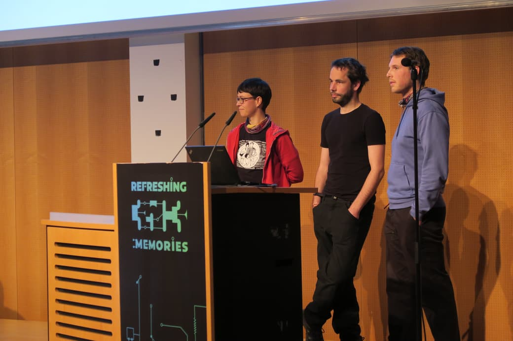

**The yunity heartbeat** - news from the world of sharing, fresh every two weeks.

## [35c3](https://events.ccc.de/congress/2018/wiki/index.php/Main_Page)
Some people anticipate Christmas, other (more nerdy) people celebrate _the Congress_ and this year we joined the latter category! ;)

Basically all of Kanthaus moved their center of activities to [Leipzig Messe](https://en.wikipedia.org/wiki/Leipzig_Trade_Fair) from December 26 to 30. We had our very own base (also called assembly) where we could inform interested people about the various projects we work on.

 
_Our assembly for foodsharing.de / Kanthaus / Karrot / Foodsaving Worldwide / everything that happens in Kanthaus_

Matthias held a [selforganized session about foodsharing.de development](https://events.ccc.de/congress/2018/wiki/index.php/Session:Foodsharing.de_call_for_web_developers) and managed to motivate some people to get involved. Doug did a lot of networking with tons of people and was quite exhausted from all the talking after a day already. Silvan and Chandi hosted [three Acroyoga jams](https://events.ccc.de/congress/2018/wiki/index.php/Session:AcroYoga) and Silvan was probably the most appreciative of all of us when it came to the gorgeous visuals of the assembly spaces and the whole fair ground.

 
_A palm made from dome pieces, tube and colorful lights_

 
_A sandbox with projected landscape that changes based on the height of the hills and actual flowing 'water'_

On Day 3 (also called December 29) Nick, Janina and Tilmann held a talk about the foodsaving grassroots movement and how cooperative online structures can facilitate sustainable offline activism. It was part of the official schedule and [here you can still watch it online](https://media.ccc.de/v/35c3-9882-the_foodsaving_grassroots_movement).

 
_The Karrot team on stage_

_by Janina_

## [Karrot](https://karrot.world)
Winter of Karrot! Gothenburg funding!

## [Harzgerode / Haus X](http://freiefeldlage.de/)
Quiet New Year's in the snow...

## [Foodsaving Worldwide](https://foodsaving.world)
Malta? Paris? News from existing groups? Some extra mention of Japan?

## [Kanthaus](https://kanthaus.online)
Anything..? xD

## About the heartbeat.
The heartbeat is a fortnightly summary of what happens in yunity. It is meant to give an overview over our currents actions and topics.

### How to contribute?
Talk to us in [#heartbeat](https://yunity.slack.com/messages/heartbeat/) on [Slack](https://slackin.yunity.org) if you want to add content, change the layout or any other heartbeat related issues and ideas! We are also happy about any kind of feedback! ^\_^
