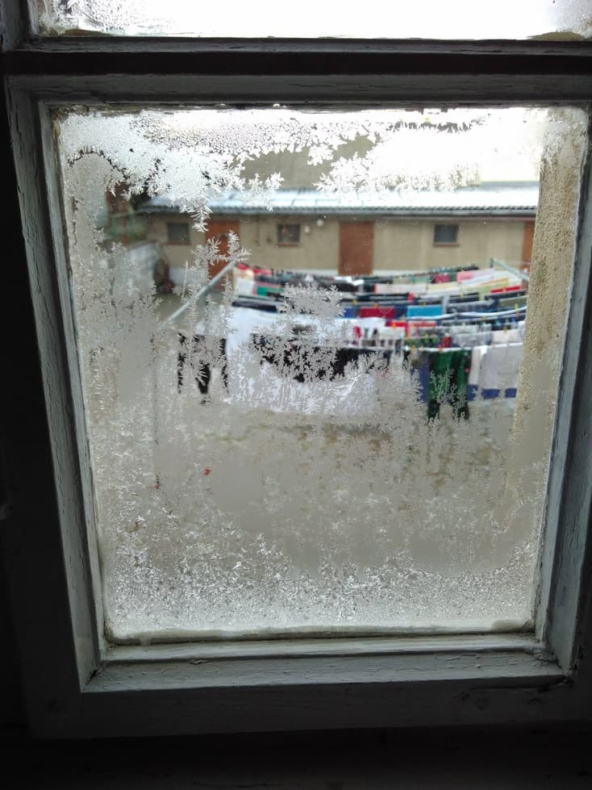
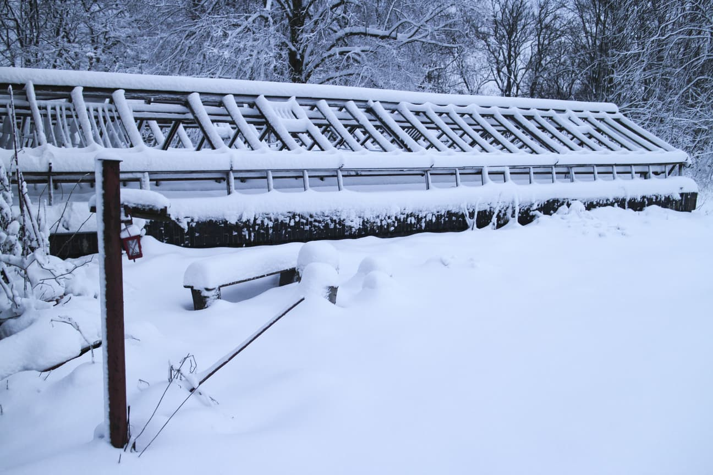
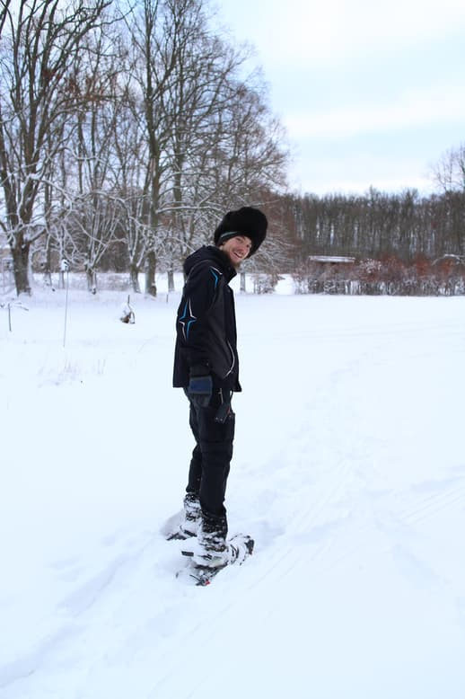
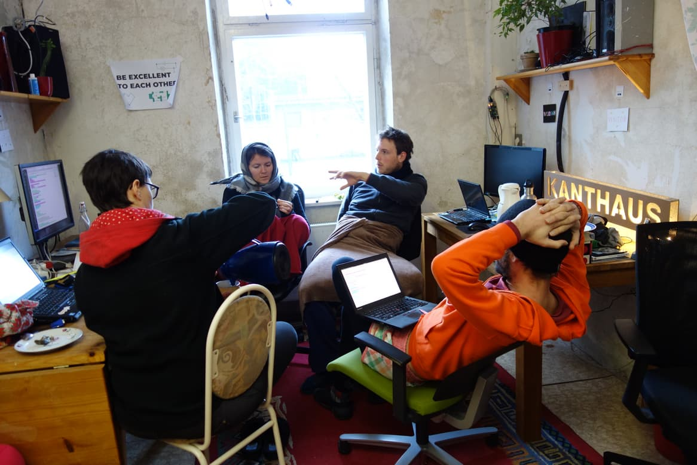
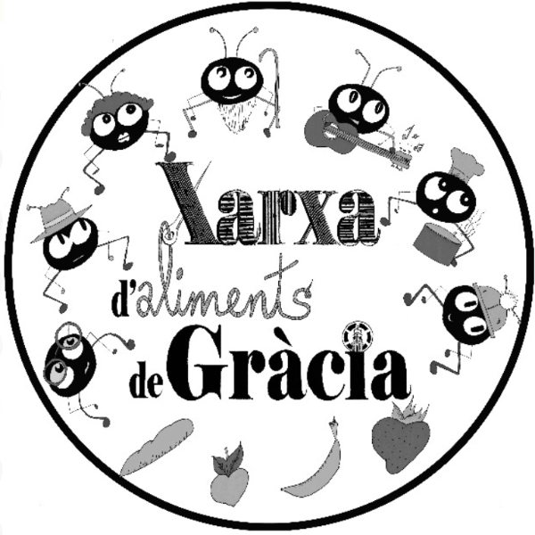

**The yunity heartbeat** - news from the world of sharing, fresh every two weeks.

## [Kanthaus](https://kanthaus.online)

With all earthly movements slowing down, animals curling up to keep warm, regenerating their energy for the summer, we are also using the darkest season to turn inwards and renew our focus.

 
_Frost patterns on one Kanthaus bathroom window_

The unprecedented “Month of Calm” started on the 18th of January. For a month no new visitors will be accepted, allowing us to power down, focus on one another and the house and talk about all the things that needed to be talked about! We've had several sessions about performance pressure regarding projects in Kanthaus, sharing thoughts and experiences and discussing possible solutions. We've also done a basement swap of K20 and K22 by building a chain of all 13 people here between the two basements, handing over stuff from one to another for not more than an hour!

We've been blessed to have loads of delicious cake & tea recently and are happy to announce that we finally, finally have new OVEN!!!

A highlight was definitely our Karaoke night (Song of the month is ["Freed from desire" by GALA](https://www.youtube.com/watch?v=p3l7fgvrEKM)), which uncovered many gifted singers amongst our midst. And, not to forget, we’ve been trying the dinner lottery, and really had something to look forward with meal pairs such as Chandi and Tilmann or Doug and Thore! Let's see what fortuna has in mind for us next time :)

_by Clara_

## [Harzgerode / Haus X](http://freiefeldlage.de/)

The frosty claws of winter hold Harzgerode tightly. The outside temperature drops to -8°C at night and the end of our hot phase is in sight: The buying contract for the whole property is ready to be signed and we got an OK from all lenders to continue until we navigate the project into the financially save harbor.

 
_The gardener's house under a veil of snow_

While watching the snowflakes falling it's big fun to start planning the activities for the upcoming summer. We are thrilled to have the MOVE utopia at our place. It's almost unthinkable that soon we will again sit on the balcony behind this window (now covered in frost patterns) sweating under the big sunshade.

It’s a damned good feeling that the future of this huge project becomes safer and safer. So even if we definitely love the winter wonderland we find ourselves in, we can’t await spring to arrive, to kiss the site awake and convert it into a busy anthill after this very office-heavy winter.

 
_Warm hats are a must!_

_by Steffen_

## [Karrot](https://karrot.world)

As the end of the Karrot winter roadmap is coming up, here's a brief review about the last 3 months:

- [improved the Karrot Android app](https://github.com/yunity/karrot-frontend/issues/984), with additional benefits for the mobile page
- [make recurring pickups more predictable](https://community.foodsaving.world/t/pickups-refreshed/199), allow disabling of pickups
- email replies to wall messages now go into a thread
- pickup collectors are now ordered by join date
- show pickup until 30 minutes after start time, to make it easier accessing the chat
- allow unsubscribing from email notifications without logging in
- [added group logo support](https://community.foodsaving.world/t/new-upload-your-group-logo/209)
- automated removal of inactive group members
- started working [on a conflict resolution feature](https://community.foodsaving.world/t/conflict-resolution-with-possibility-to-remove-user-from-group/201) - to be released in February!
- held [a talk at 35C3](https://media.ccc.de/v/35c3-9882-the_foodsaving_grassroots_movement)
- held the [Winter of Karrot](https://kanthaus.online/events/2019-01-01_winter-of-karrot) to work together on Karrot development
- ... and much more, have a look [at the changelog](https://github.com/yunity/karrot-frontend/blob/master/CHANGELOG.md)!

This has also been [posted to the community forum](https://community.foodsaving.world/t/collecting-and-voting-on-feature-requests-for-karrot-spring-2019/217)) and if you want to have a say on what should be implemented next, you can comment on that thread!

We started having weekly meetings about the Karrot Bike Kitchen project. Bruno and Sebastian arranged usability tests amongst the Gothenburg users and Janina started summarizing the results. Nick prepared to implement end dates for pickups and Tilmann added a store conversation prototype.

Janina and Tais have been working hard to connect the conflict resolution UI to the backend. They did a good job to slowly move from mock data towards integrating a data store and making API calls.

 
_One of the daily morning meetings of the Karrot team_

_by Tilmann_

## [Foodsaving Worldwide](https://foodsaving.world)

Lukas - who has been part of the team since old yunity days - lived in Barcelona for the past months and did a lot of research about how foodsaving is working in the Catalan metropolis. His findings include knowledge about the decentralized Xarxas that do save food but are not really known or connected. Another foodsaver, Isa from Vienna, tried building up a more scalable foodsaving initiative already over a year ago, but it didn't ever work out. So this time Lukas focused more on the existing Xarxas and got in touch with some of them - to take part in their structures as well as promoting Karrot.

He found quite some open ears as it seems and one of the biggest Xarxas, the one of Banc Expropriat, might very well start using Karrot to coordinate their foodsaving soon. Well, at least they'll try it out... ;)

 
_Logo of Banc Expropriat's xarxa_

It seems to simply the the right time, because judging by Lukas the Xarxas themselves started to see the benefits of associating with each other and forming a bigger entity together. It is really just starting out, but a [domain for a common website](https://xarxesdaliments.wordpress.com/) has already been registered. You can rest assured that we'll continue following the developments!

_by Janina_

## About the heartbeat.
The heartbeat is a fortnightly summary of what happens in yunity. It is meant to give an overview over our currents actions and topics.

### How to contribute?
Talk to us in [#heartbeat](https://yunity.slack.com/messages/heartbeat/) on [Slack](https://slackin.yunity.org) if you want to add content, change the layout or any other heartbeat related issues and ideas! We are also happy about any kind of feedback! ^\_^
