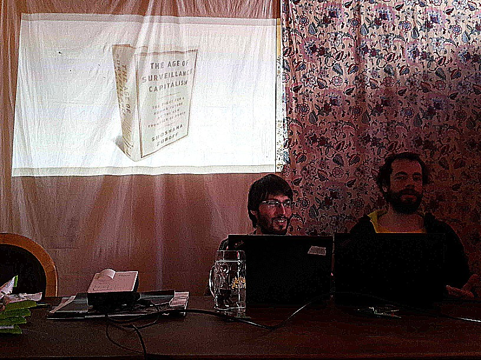
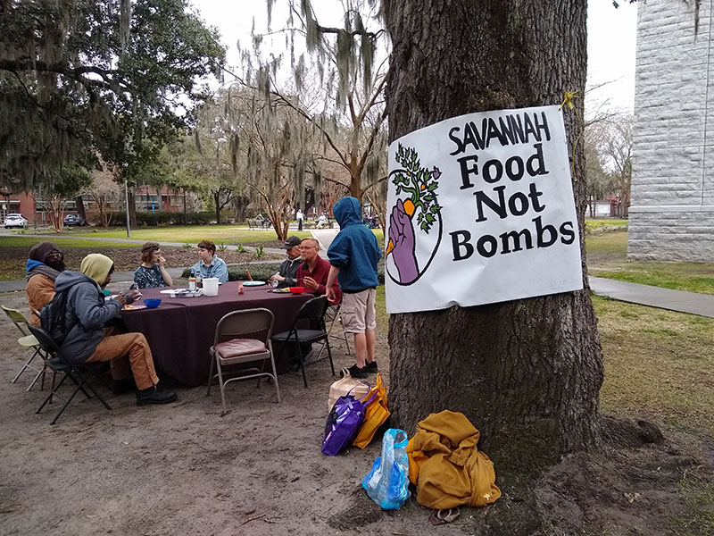

**The yunity heartbeat** - news from the world of sharing, fresh every two weeks.

## [Kanthaus](https://kanthaus.online)
We seem to have misnamed the 'Month of Calm', because in many ways it's been *more* intense! The energy freed up by not needing to induct new people has been invested in various sessions and discussions: Chandi held a '[cryptoparty](https://www.cryptoparty.in/)' to help people better protect their data, the Karrot Crew demonstrated the developments they made over their work month (more below) and Nick and Matthias presented the [HouseBus](https://github.com/NerdyProjects?utf8=%E2%9C%93&tab=repositories&q=house&type=&language=) system—a 'smart-home' project which respects data privacy.

 
_Smart-homes without surveillance capitalism? Yes, it's possible!_ 

One topic that got a lot of attention was money. Bodhi, Luisa and I organized 4 sessions to investigate how the principle of 'promote sharing, prevent waste' could apply to this strange resource in the Kanthaus context. I was impressed at how open and trusting people were to share their personal situations, hopes and fears on a topic which is normally taboo. Next week we'll be trying to convert the ideas into testable proposals.

I get the general feeling the Month of Calm has been appreciated and that we'll want to hold a similar month next year.

_Doug_

## [Harzgerode / Haus X](http://freiefeldlage.de/)

## [Karrot](https://karrot.world)

## [Foodsaving Worldwide](https://foodsaving.world)

Recently we had our first person from the U.S. sign up on our forum and immediately post super nice [Greetings from Savannah](https://community.foodsaving.world/t/greetings-from-savannah). The person called wutogui is part of the [Savannah chapter](https://www.facebook.com/SavannahFNB/) of [Food not Bombs](http://foodnotbombs.net) (FNB) and told us a lot about what they are doing with regards to saving food and sharing it with people in need. Interestingly FNB explicitly identifies _not_ as charity but as anarchic solidarity movement that fights waste and by that is completely in line with our vision of foodsaving. We hope to strengthen this relationship and find ways to support each other regularly! :)

 
_A vegan meal distribution event in a Savannah park._  

_by Janina_

## About the heartbeat.
The heartbeat is a fortnightly summary of what happens in yunity. It is meant to give an overview over our currents actions and topics.

### How to contribute?
Talk to us in [#heartbeat](https://yunity.slack.com/messages/heartbeat/) on [Slack](https://slackin.yunity.org) if you want to add content, change the layout or any other heartbeat related issues and ideas! We are also happy about any kind of feedback! ^\_^
