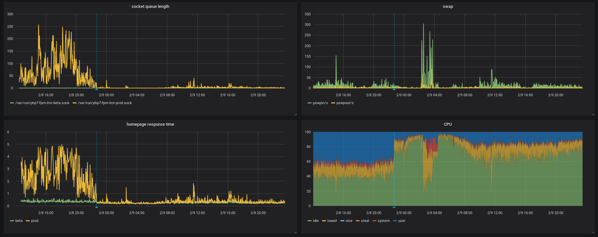

**The yunity heartbeat** - news from the world of sharing, fresh every two weeks.

## [Harzgerode](http://freiefeldlage.de/)

Busy times. While the usual paperwork goes on, preparations for the upcoming season start slowly.
Requests from volunteers willing to participate and help start piling up. Though we are honored by this we are definitely not ready yet to host or even employ those helpers.
So first steps are taken. Writing down tasks, getting material etc. so the place will be prepared to become the regularly mentioned busy anthill as soon as spring arrives.

 
_Fixing the chimney, secured by climbing gear_

Meanwhile the chimney of Haus X is finally ready for official approval by the chimney sweeper.
Unfortunately the newly installed plastic tarpaulin covering the leaking roof of the extension of Haus X just flew away in the storm.

 
_Anna and Josi carrying a shelf to its new location_

We are looking forward to have a professional workshop for the use of a chainsaw at our place in two weeks, so we learn how to safely make firewood from the countless fallen trees in our forests.

_by Steffen_

## [Kanthaus](https://kanthaus.online)

We seem to have misnamed the 'Month of Calm', because in many ways it's been *more* intense! The energy freed up by not needing to induct new people has been invested in various sessions and discussions: Chandi held a '[cryptoparty](https://www.cryptoparty.in/)' to help people better protect their data, the Karrot Crew demonstrated the developments they made over their work month (more below) and Nick and Matthias presented the [HouseBus](https://github.com/NerdyProjects?utf8=%E2%9C%93&tab=repositories&q=house&type=&language=) system—a 'smart-home' project which respects data privacy.

 
_Smart-homes without surveillance capitalism? Yes, it's possible!_

One topic that got a lot of attention was money. Bodhi, Luisa and I organized 4 sessions to investigate how the principle of 'promote sharing, prevent waste' could apply to this strange resource in the Kanthaus context. I was impressed at how open and trusting people were to share their personal situations, hopes and fears on a topic which is normally taboo. Next week we'll be trying to convert the ideas into testable proposals.

I get the general feeling the Month of Calm has been appreciated and that we'll want to hold a similar month next year.

_Doug_

## [foodsharing.de](https://foodsharing.de) dev

There is lots going on in foodsharing development, but I'll share just one thing (mostly as it has a pretty picture to go with it).

The site has been running quite slow, and there were lots of chats about how to improve it. The mystery was that the beta version of the
site was still running fast on the same server. They use the same database and redis service so it wasn't related to that and they are both running with the same version of php. One of the main differences was the beta site had 2 php workers whereas the production site had 5. So perhaps we had not enough workers?

If there aren't enough workers to serve the requests they are added to a queue, and we have been collecting the stats about the php-fpm queue
length for some time now. However, it is always 0. Hmmm.

But a spark of imagination later and we realised that there is another place it can queue. Between the nginx webserver and the php-fpm process is a unix socket and that has it's own queue. And despite the myriad of different stats we collect about the server and app, that was not one of them.

The simple solution would be to just change the number of php-fpm workers, but I wanted to really know whether it makes a difference by collecting data and also make sure other things were not negatively affected.

I added stat collection for two extra things (for both beta and production) - the unix socket queue length, and the home page response time (as measured from another server). I left that running for about 12 hours before adding another 2 php-fpm workers (so changing from 5 to 7). Here are the graphs showing the impact:

_Top left is queue length (yellow prod, green beta), bottom left is response time (yellow prod, green beta), top right is swap usage, bottom right is CPU usage (green is idle/free), the vertical dotted blue line is when I made the configuration change_

Our server does not have much spare memory so adding extra workers might have been an issue - one of potential issues would show if the system started using a lot of swap, so I included a graph for that, but fortunately swap usage didn't change much.

The result, happy people!

To make it more relatable the problem was the same as when a busy supermarket does not have enough checkouts open, the solution: open more checkouts!

The remaining mystery is noticing that the CPU usage went _down_ quite a lot (more idle time, shown in green). If you know why, maybe you should join the foodsharing dev team!

## [Karrot](https://karrot.world)

## [Foodsaving Worldwide](https://foodsaving.world)

Recently we had our first person from the U.S. sign up on our forum and immediately post super nice [Greetings from Savannah](https://community.foodsaving.world/t/greetings-from-savannah). The person called wutogui is part of the [Savannah chapter](https://www.facebook.com/SavannahFNB/) of [Food not Bombs](http://foodnotbombs.net) (FNB) and told us a lot about what they are doing with regards to saving food and sharing it with people in need. Interestingly FNB explicitly identifies _not_ as charity but as anarchic solidarity movement that fights waste and by that is completely in line with our vision of foodsaving. We hope to strengthen this relationship and find ways to support each other regularly! :)

 
_A vegan meal distribution event in a Savannah park._  

_by Janina_

## About the heartbeat.
The heartbeat is a fortnightly summary of what happens in yunity. It is meant to give an overview over our currents actions and topics.

### How to contribute?
Talk to us in [#heartbeat](https://yunity.slack.com/messages/heartbeat/) on [Slack](https://slackin.yunity.org) if you want to add content, change the layout or any other heartbeat related issues and ideas! We are also happy about any kind of feedback! ^\_^
