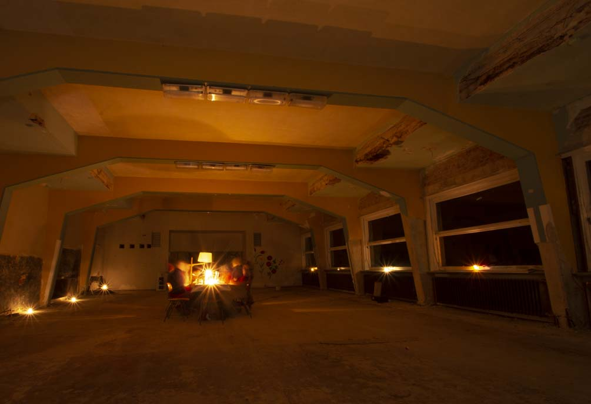
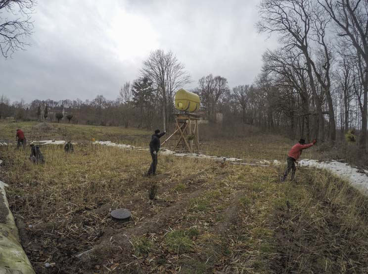
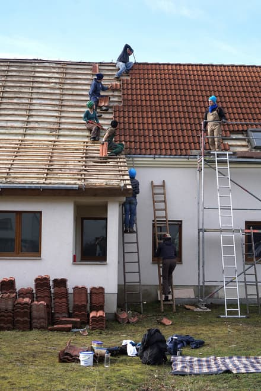
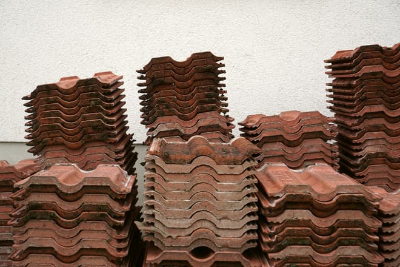

**The yunity heartbeat** - news from the world of sharing, fresh every two weeks.

## [Harzgerode](http://freiefeldlage.de/)

Time to celebrate!

We finally got the information we awaited for _soooo_ long: Harzgerode will get more than 100.000 € funding to reactivate the theater hall. It is quite unlikely, but still possible that the hall will be ready to use for the upcoming festival(s?) in summer. A part of the money also will be used for some urgent repairs of some roofs of other buildings.

 
_Celebration in the ruins of the theater hall_

Last weekend we had some guests interested in community living who asked a lot of questions and helped us remove weed from the bio sewage plant to make it ready for the challenging summer.

 
_Working in the bio sewage plant_

The times when Harzgerode and frosty living rooms were one and the same seem to finally end. Today the main building is connected to the gas grid and Saturday the water system will be completed. Seems like Steffen can finally keep his promise from 15 months ago to “go on vacation to Kanthaus as soon as the heating system is online”. ;)

Meanwile Haus X proves for another time  that an independent solar powered energy system is a cool thing to have. Three power failures within the last five days made Haus X the only house with electric light in the whole of Harzgerode. Should we put a sign at our front door “Energy refugees welcome!” ?

_by Steffen_

## [Kanthaus](https://kanthaus.online)

The times of leaking roofs will be over -  We spent one day in the lovely Saxon countryside to take down the tiles of a house that will soon be demolished. What served this house well for 20 years, will hopefully suit ours for at least 20 more years! Besides optimizing our chain of passing over tiles across the roof we even had time for a little pick nick in the sunshine.
In the end we had miles of tiles which we put in ailes of piles!! ^^

 
_Passing down the tiles one by one via a chain of people_

The unfortunate turn our roof plans took when we met with the architect of our hearts - Corinna - last week is that we will need to reinforce the wooden construction of the roof if we want to put tiles and insulating material up there. This means we'd need to file an application for construction permit, which means that everything will be delayed for months... Good thing that tiles don't rot and whenever we're ready to _really_ put them on our roof there already there, waiting patiently.

 
_Nicely stacked tiles_

_by Clara and Janina_

## About the heartbeat.
The heartbeat is a fortnightly summary of what happens in yunity. It is meant to give an overview over our currents actions and topics.

### How to contribute?
Talk to us in [#heartbeat](https://yunity.slack.com/messages/heartbeat/) on [Slack](https://slackin.yunity.org) if you want to add content, change the layout or any other heartbeat related issues and ideas! We are also happy about any kind of feedback!
