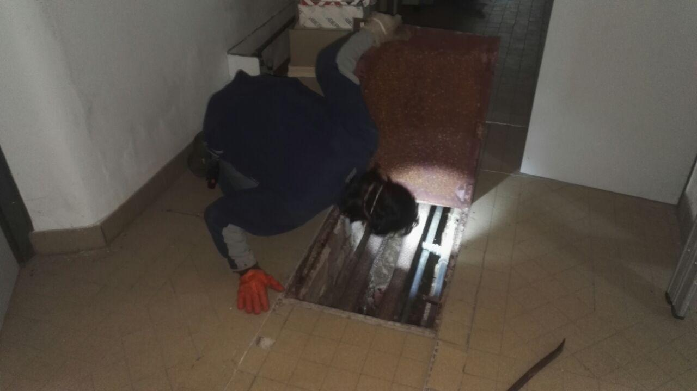
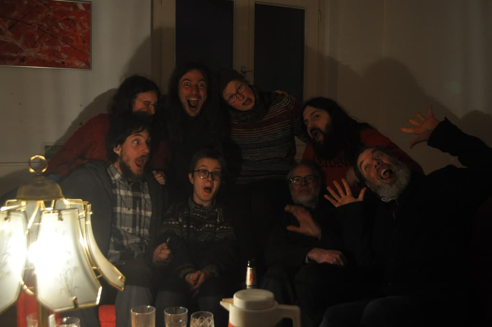

**The yunity heartbeat** - news from the world of sharing, fresh every two weeks.

## [Harzgerode](http://freiefeldlage.de/)
Harzgerode is preparing for a busy summer full of beautiful people, events, construction and building work. Loads of tools and material are already there, all we need now are well sorted and organized workshop and material storage rooms, and the building frenzy can start!

 
_Matthias looking at old pipes. Where might they go..?_

A good reason for the initialization of this phase is the MOVE building week which is about to start! From Friday to Friday we  will finalize the workshop setup and start building loads of cool stuff for the [MOVE utopia](https://move-utopia.de). If you would like to help building things or sorting screws and nails, you can still join us! Just write an email to: prozess@move-utopia.de. This event also sort of seems to mark the end of winter with outdoor facilities such as the solar-shower and the outdoor kitchen being reconnected or reopened! yeay :)

And to frame all this activity the best way possible, the community could finally sign the contract that made them owners of the whole hospital area! No more need to worry about getting kicked out and time to celebrate the huge success already reached!

 
_Success apparently makes silly...^^_

_by Bodhi_

## [Kanthaus](https://kanthaus.online)
We are intensifying our ties to the local community: Last week we had the first networking meeting with three other local initiatives, namely Villa Klug, [NDK](https://www.ndk-wurzen.de/) and [the Laden](https://schweizerhaus-puechau.jimdo.com/der-laden/). We called it "Kaffekränzchen" (en: coffee party) and plan to hold this kind of meeting quarterly from now on. The idea is to be more informed about what the others are actually doing, to coordinate when scheduling events, to help each other out with (wo)menpower and stuff and potentially make something cool happen together at some point.

On top of that Nathalie is working hard to make the free shop ready for its official opening. We already have a date: On the 23rd of April we will start with our Open Tuesdays - a combination of food-share point, repair cafe, maker space, free shop and cake. It will take place between 4 and 6 pm and we're looking forward to welcoming a lot of interested Wurzeners. For that to happen there's still a lot of pr work to do which we will tackle in the coming weeks.

_by Janina_

## [Foodsaving Worldwide](https://foodsaving.world)
Apparently [Foodsharing Hamar](https://www.facebook.com/handtilmunnHamar/) is starting! Judging from the kind English summary of [this video](https://www.youtube.com/watch?v=ItTHUfUk9rw), the Norwegian town now has a public food-share point and is actively recruiting foodsavers. Way to go! :)

_by Janina_

## [Karrot](https://karrot.world)
Hello all Karrot-eating kidz! This is Bruno writing his first heartbeat about Karrot development, so I apologize in advance for not explaining properly what happened lately or missing out on important stuff.

The first and most remarkable happening is that the [much awaited conflict-resolution feature](https://community.foodsaving.world/t/conflict-resolution-with-possibility-to-remove-user-from-group/201) was finally released! Thanks to the work put in by Janina, Taïs, Tilmann and Nick, groups can discuss and vote to kick out all of their naughty non-Karrot-eating kidz. This is a pretty nice feature that can be the base for future governance features, whenever groups need to make critical decisions without depending on the sometimes arbitrary powers of a single or handful of admins.

A [store wall and subscription](https://community.foodsaving.world/t/introducing-store-wall-and-store-subscriptions/241) has also been introduced as a way to facilitate the visibility of communication and pickups of the store or place of your choice. This can be particularly useful for large groups in which people are mostly interested in the pickups and conversation related to one or a few favorite stores. Still there is room for improvement and we’re collecting feedback on the forum thread.

Last but not least, we continue to work and mature the idea of generalizing Karrot for other use cases, working with the Bike Kitchens in Gothenburg as a second use case that has nothing to do with food (kitchen is just the name), but everything to do with saving and repairing bikes. The similarities go so far as it is about groups of people associating freely and organizing in a non-hierarchical way to save and share resources. There is plenty of potential there! But how do we re-structure the database and the UI for that? Please, [give us some food for thought](https://github.com/yunity/karrot-frontend/issues/1127)!

I’ll be around for my first time in Kanthaus in the next week to visit Janina and Tilmann and work more on Karrot. Looking forward to see the place and meet the people!

_by Bruno_

## About the heartbeat.
The heartbeat is a fortnightly summary of what happens in yunity. It is meant to give an overview over our currents actions and topics.

### How to contribute?
Talk to us in [#heartbeat](https://yunity.slack.com/messages/heartbeat/) on [Slack](https://slackin.yunity.org) if you want to add content, change the layout or any other heartbeat related issues and ideas! We are also happy about any kind of feedback!
