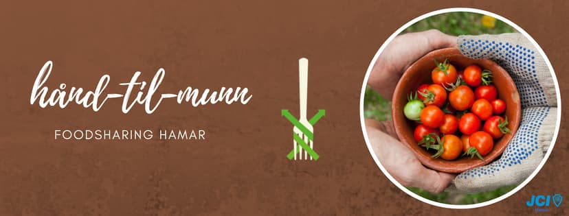

**The yunity heartbeat** - news from the world of sharing, fresh every two weeks.

## [Harzgerode](http://freiefeldlage.de/)

## [Kanthaus](https://kanthaus.online)
We are intensifying our ties to the local community: Last week we had the first networking meeting with three other local initiatives, namely Villa Klug, [NDK](https://www.ndk-wurzen.de/) and [the Laden](https://schweizerhaus-puechau.jimdo.com/der-laden/). We called it "Kaffekränzchen" (en: coffee party) and plan to hold this kind of meeting quarterly from now on. The idea is to be more informed about what the others are actually doing, to coordinate when scheduling events, to help each other out with (wo)menpower and stuff and potentially make something cool happen together at some point.

On top of that Nathalie is working hard to make the free shop ready for its official opening. We already have a date: On the 23rd of April we will start with our Open Tuesdays - a combination of food-share point, repair cafe, maker space, free shop and cake. It will take place between 4 and 6 pm and we're looking forward to welcoming a lot of interested Wurzeners. For that to happen there's still a lot of pr work to do which we will tackle in the coming weeks.

_by Janina_

## [Foodsaving Worldwide](https://foodsaving.world)
Apparently [Foodsharing Hamar](https://www.facebook.com/handtilmunnHamar/) is starting! Judging from the kind English summary of [this video](https://www.youtube.com/watch?v=ItTHUfUk9rw), the Norwegian town now has a public food-share point and is actively recruiting foodsavers. Way to go! :)

_by Janina_

## [Karrot](https://karrot.world)

## About the heartbeat.
The heartbeat is a fortnightly summary of what happens in yunity. It is meant to give an overview over our currents actions and topics.

### How to contribute?
Talk to us in [#heartbeat](https://yunity.slack.com/messages/heartbeat/) on [Slack](https://slackin.yunity.org) if you want to add content, change the layout or any other heartbeat related issues and ideas! We are also happy about any kind of feedback!
