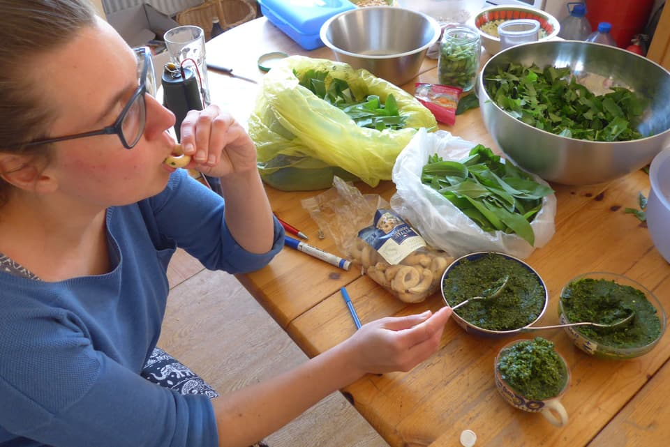
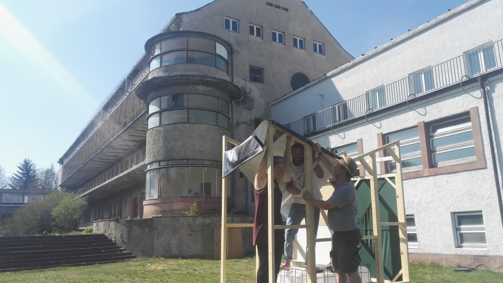

**The yunity heartbeat** - news from the world of sharing, fresh every two weeks.

## [Harzgerode](http://freiefeldlage.de/)

This is rare in Harzgerode: Joy at the end of winter shortly before Easter! The long-awaited wild garlic festival could take place on the selected date thanks to frosty temperatures in which the tasty leaf green slowed down its growth. And in keeping with the festival, the sun brought spring fever to the Eastern Harz.

 
_Nathalie trying the different kinds of pesto._

The area of Freie Feldlage is surrounded by a sea of wild garlic, which was just waiting to be processed into pesto, spinach, quiche and other delicacies. During the entire Easter weekend, the processing of wild garlic ran at full speed in Haus X, while every now and then visitors came by for a pesto test meal. Whether with pine nuts, roasted or unroasted sunflower seeds, pesto only from large leaves or small ones, refined with a few wild garlic buds or not... there was definitely enough choice to find your personal favorite.

 
_Anna, Ben and Bodhi building the roof of a compost toilet using recycled tarp._

But not only the wild garlic was celebrated. The Freie Feldlage has some success to report, beside the signed sales contract now also the cooperative was officially registered. A prototype for the fleet of mobile compost toilets, which are to be used at the numerous outdoor events, was built and the team of the undjetzt?!-Konferenz took a closer look at the location for this year's conference. In addition, two [workawayers](https://www.workaway.info/831333237576-en.html) helped in the garden to make good progress. So there is a lot going on in Harzgerode and everyone is positive that the community is on the right track.

_by Lise_

## [Utopival](utopival.de)

After the drastic events at the utopival 2017, this year there is a new chance to experience a week that can change lives.

A week of getting together with likeminded people and learning about important topics of social and environmental change. A week of finding new inspiration and motivation for actually becoming active. A week of making new connections and friends for life. A week of summer, dancing and music at the bonfire. A week of late starry nights and deep questions. A week that you won't forget so easily.

The time will be framed by the five values „vegan“, „exchangelogic-free“, „drugfree“, „solidary“ and „ecological“.
A small group of people is currently committed to do everything within their power to make the utopival this year another unforgettable experience. On Tuesday evening it will be decided where and when exactly the utopival will happen. It's probably at the beginning of September but the exact date will soon be announced on the [website](utopival.de) immediately. The application will be open until the 30th of May and afterwards 100 people will be drawn lots for.

_by Findus_

## [MOVE UTOPIA](https://move-utopia.de/)

MOVE preparation is in full swing. Not only in Harzgerode, but also at Kanthaus busy times are lying ahead: On the upcoming weekend the next MOVE meeting will take place at Kanthaus. This includes a lot of discussions about values, typing drafts, sending emails, making phone calls and realizing smaller and bigger ideas, but also spending time with beautiful people that are growing together in the process of organizing such a huge event together.

The [MOVE](move-utopia.de) is about various people, groups and initiatives coming together to support change towards a world in which people live according to their needs and abilities. There will be a colorful program consisting of topics like permaculture, commons, critique of domination, communal living, degrowth, (queer-)feminism and much more. The MOVE will be a place to learn from and with each other, to develop strategies for social change, to build up sustainable connections and structures, to discuss and, of course, also to dance, laugh, sit around bonfires exchanging dreams, make new friends and enjoy life.

Application will also start on Tuesday and ideas for workshops or other topics are always welcome! You can contact us via info@move-utopia.de.

_by Findus_

## [Kanthaus](https://kanthaus.online)

Kanthaus now has a free shop that is open two hours per week! On April 23 we held the grand opening and introduced our new concept of 'Open Tuesday': Every Tuesday between 4 and 6 pm we open our free shop, our food share point and our workshops to the public. We want to share items, skills and thoughts and create a frame for local people to meet and discuss sustainability and technology topics. For the grand opening we invited a lot of press which led to two new newspaper articles about us. [Here's one of them.](https://kanthaus.online/de/about/press/2019-04-24_wln-freeshop)

 
_The newly opened freeshop!_

Other things that happened in Kanthaus over the past months are that Tilmann established a jar norm to fill the new shelf that he built in the snack kitchen storage with only three different lid sizes. Anja extended our herb bed in the garden, Clara kept on decorating the house, Matthias installed a sound system in the electronics workshop and many more little things as they usually happen here.

 
_Anja next to her nice new herb bed._

_by Janina_

## [Karrot](https://karrot.world)

An ongoing topic for Karrot is improving usability, especially the navigation structure is sometimes unclear to users. When we introduced the store wall, many had a hard time finding it. The problem was that the sidenav changed when switching pages, which is not something that people are used to.
To improve that, we moved the navigation into a uniform store header _on_ the page. That should improve visibility and also make clearer which page is currently shown.

 
_Old store navigation in the sidenav_

 
_New store tab navigation_

Two students from the University of Michigan worked on Karrot as part of their final assignment. They chose to improve the emoji reaction picker. Before, the picker only showed 5 selected emoji. Now, users can search through the huge unicode emoji catalog.
We had to overcome a few issues when implementing it:
- Emoji names are not standardized and sometimes two names for the same emoji exist. By defining one standard name for each emoji, we could properly merge equal reactions together.
- Quasar, the user interface library that Karrot uses, has problems positioning the reaction popover when the size is not defined. We worked around that by always setting a fixed size that should fit all common screens.

 
_Old emoji reaction picker_

 
_Now you can search through a huge emoji catalog when giving reactions_

Another recent change was the addition of a group welcome message. When users get accepted into a group, they already receive an email. Now it's possible to specify a message that will get included into the email.

 
_Group welcome message form_

Other recent activity:
- a new voting about feature requests [has been started](https://community.foodsaving.world/t/collecting-and-voting-on-feature-requests-summer-2019/268)
- there's a draft how [meetings could be implemented](https://github.com/yunity/karrot-frontend/pull/1450)
- experiments with [public places](https://github.com/yunity/karrot-frontend/pull/1449)
- a bug has been fixed that would cause trust to be removed
- a lot of discussion in the [community forum](https://community.foodsaving.world), for example about [pickup statistics](https://community.foodsaving.world/t/statistics-about-the-amount-of-saved-food/85/12)

_by Tilmann_

## [Foodsaving Worldwide](https://foodsaving.world)

## About the heartbeat.
The heartbeat is a monthly summary of what happens in yunity. It is meant to give an overview over our currents actions and topics.

### How to contribute?
Talk to us in [#heartbeat](https://yunity.slack.com/messages/heartbeat/) on [Slack](https://slackin.yunity.org) if you want to add content, change the layout or any other heartbeat related issues and ideas! We are also happy about any kind of feedback!
