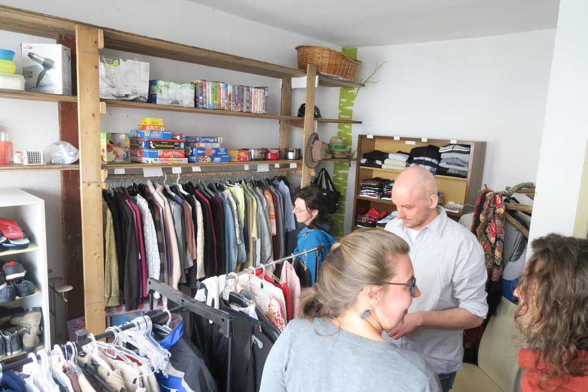
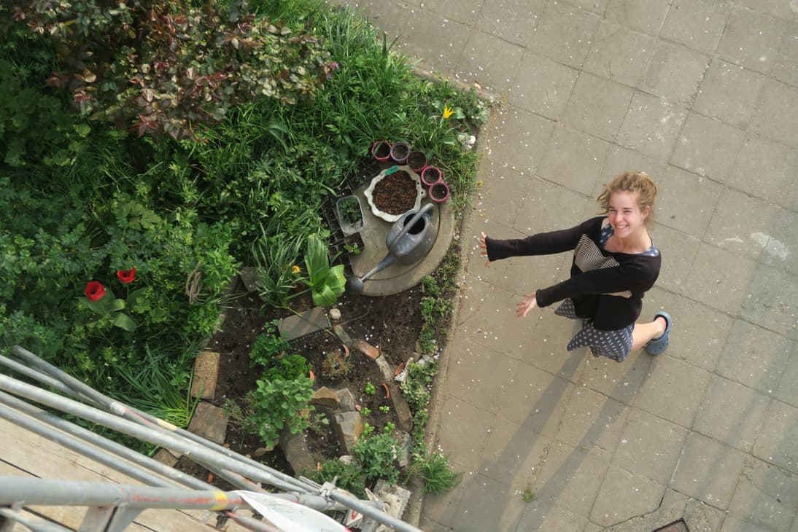
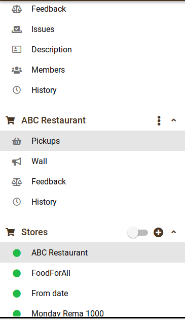

**The yunity heartbeat** - news from the world of sharing, fresh every two weeks.

## [Kanthaus](https://kanthaus.online)
Kanthaus now has a free shop that is open two hours per week! On April 23 we held the grand opening and introduced our new concept of 'Open Tuesday': Every Tuesday between 4 and 6 pm we open our free shop, our food share point and our workshops to the public. We want to share items, skills and thoughts and create a frame for local people to meet and discuss sustainability and technology topics. For the grand opening we invited a lot of press which led to two new newspaper articles about us. [Here's one of them.](https://kanthaus.online/de/about/press/2019-04-24_wln-freeshop)

 
_The newly opened freeshop!_

Other things that happened in Kanthaus over the past months are that Tilmann established a jar norm to fill the new shelf that he built in the snack kitchen storage with only three sized of lids. Anja extended our herb bed in the garden, Clara kept on decorating the house, Matthias installed a sound system in the electronics workshop and many more little things as they usually happen here.

 
_Anja next to her nice new herb bed._

_by Janina_

## [Harzgerode](http://freiefeldlage.de/)

## [Karrot](https://karrot.world)

An ongoing topic for Karrot is improving usability, especially the navigation structure is sometimes unclear to users. When we introduced the store wall, many had a hard time finding it. The problem was that the sidenav changed when switching pages, which is not something that people are used to.
To improve that, we moved the navigation into a uniform store header _on_ the page. That should improve visibility and also make clearer which page is currently shown. 

 
_Old store navigation in the sidenav_

 
_New store tab navigation_

Two students from the University of Michigan worked on Karrot as part of their final assignment. They chose to improve the emoji reaction picker. Before, the picker only showed 5 selected emoji. Now, users can search through the huge unicode emojie catalogue.
We had to overcome a few issues when implementing it: 
- emoji names are not standardized and sometimes two names for the same emoji exists. By defining one standard name for each emoji, we could properly merge equal reactions together.
- Quasar, the user interface library that Karrot uses, has problems positioning the reaction popover when the size is not defined. We worked around that by always setting a fixed size that should fit all common screens.

 
_Old emoji reaction picker_

 
_Now you can search through a huge emoji catalogue when giving reactions_

Another recent change was the addition of a group welcome message. When users get accepted into a group, they already receive an email. Now it's possible to specify a message that will get included into the email.

 
_Group welcome message form_

Other recent activity:
- a new voting about feature requests [has been started](https://community.foodsaving.world/t/collecting-and-voting-on-feature-requests-summer-2019/268)
- there's a draft how [meetings could be implemented](https://github.com/yunity/karrot-frontend/pull/1450)
- experiments with [public places](https://github.com/yunity/karrot-frontend/pull/1449)
- a bug has been fixed that would cause trust to be removed
- a lot of discussion in the [community forum](https://community.foodsaving.world), for example about [pickup statistics](https://community.foodsaving.world/t/statistics-about-the-amount-of-saved-food/85/12)

_by Tilmann_

## [Foodsaving Worldwide](https://foodsaving.world)

## About the heartbeat.
The heartbeat is a monthly summary of what happens in yunity. It is meant to give an overview over our currents actions and topics.

### How to contribute?
Talk to us in [#heartbeat](https://yunity.slack.com/messages/heartbeat/) on [Slack](https://slackin.yunity.org) if you want to add content, change the layout or any other heartbeat related issues and ideas! We are also happy about any kind of feedback!
