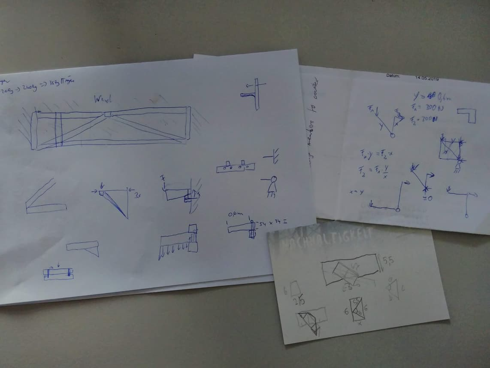

**The yunity heartbeat** - news from the world of sharing, fresh every month.

## [Kanthaus](https://kanthaus.online)

Keeping our spaces free of clutter is an ongoing battle at Kanthaus. The newest idea to solve this problem is to build shelves for boxes right below the ceiling in basically every room. Then we could store things that somehow fit to the purpose of the room directly in it. Tilmann gave this plan a lot of thought, did calculations and compared design ideas together with Matthias, and over the past month new shelf prototypes emerged in the (intermediate) storage room and in the washing room.

 
_The new shelf in the storage room_

 
_Scribbling paper from the planning of longer ones_

More sorting and tidying up happened in parallel to the planning and building of new shelves - also because our free shop gains popularity by the day! Up until now it's awesome that people want to not only take stuff but also donate, but it's just a matter of time until there's too much. So we need as much space as possible, so that we're always able to do proper sorting and keep the overview of what we already have. Because no matter how valuable something is, if it is part of an unidentifiable pile, it's nothing more than a burden.

_by Janina_

## [Foodsaving Worldwide](https://foodsaving.world)

There is momentum again in [foodsharing Luxembourg](https://www.foodsharing.lu/)! Judging from the activity in [their Karrot group](https://karrot.world/#/groupPreview/33) they hold meetings and plan how to get really active together.

We got an email from Chile again, this time from a person who experienced foodsharing in Copenhagen and is now excited to start something similar in their home country. As always, we're happy to connect people and to support them with knowledge! :)

_by Janina_

## [Karrot](https://karrot.world)

Karrots are sprouting in May! Janina and me made lots of changes to the user interface, to respond to results from recent usability tests. Goals were to reduce the cognitive load in the topbar, to make notification settings easier to find and to add the missing "applications" entry in the sidenav.

 
_Simplified topbar notification region_

Besides that, I had to move a bit slower with Karrot development as I hurt my wrists during construction works for Kanthaus. Typing on a computer keyboard turned out to be painful during that time. So I gave my wrists time to heal. This was a good opportunity to pair-program with Janina, who got to touch some code regions she never saw before!

We also completed the spring roadmap and planned the summer roadmap; I made an [announcement post](https://community.foodsaving.world/t/collecting-and-voting-on-feature-requests-summer-2019/268/16) in our community forum. I found it hard to remember many feature requests from users, so I started to create more Github issues again. This has a bit more "management overhead" than just remembering tasks from the top of my head or a simple text file.

June will probably be very quiet for Karrot development, as Janina and me will be cycling around Germany and Nick is occupied with family duties. But let's see - maybe there will be random people from the internet who step in, or we find some time on the road.

_by Tilmann_

## About the heartbeat.
The heartbeat is a monthly summary of what happens in yunity. It is meant to give an overview over our currents actions and topics.

### How to contribute?
Talk to us in [#heartbeat](https://yunity.slack.com/messages/heartbeat/) on [Slack](https://slackin.yunity.org) if you want to add content, change the layout or any other heartbeat related issues and ideas! We are also happy about any kind of feedback!
