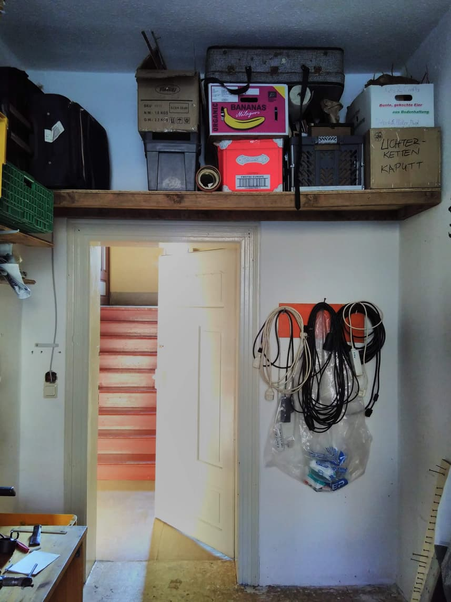

**The yunity heartbeat** - news from the world of sharing, fresh every month.

## [Kanthaus](https://kanthaus.online)

Keeping our spaces free of clutter is an ongoing battle at Kanthaus. The newest idea to solve this problem is to build shelves for boxes right below the ceiling in basically every room. Then we could store things that somehow fit to the purpose of the room directly in it. Tilmann gave this plan a lot of thought, did calculations and compared design ideas together with Matthias, and over the past month new shelf prototypes emerged in the (intermediate) storage room and in the washing room.

 
_The new shelf in the storage room_

 
_Scribbling paper from the planning of longer ones_

More sorting and tidying up happened in parallel to the planning and building of new shelves - also because our free shop gains popularity by the day! Up until now it's awesome that people want to not only take stuff but also donate, but it's just a matter of time until there's too much. So we need as much space as possible, so that we're always able to do proper sorting and keep the overview of what we already have. Because no matter how valuable something is, if it is part of an unidentifiable pile, it's nothing more than a burden.

_by Janina_

## [Karrot](https://karrot.world)

## About the heartbeat.
The heartbeat is a monthly summary of what happens in yunity. It is meant to give an overview over our currents actions and topics.

### How to contribute?
Talk to us in [#heartbeat](https://yunity.slack.com/messages/heartbeat/) on [Slack](https://slackin.yunity.org) if you want to add content, change the layout or any other heartbeat related issues and ideas! We are also happy about any kind of feedback!
