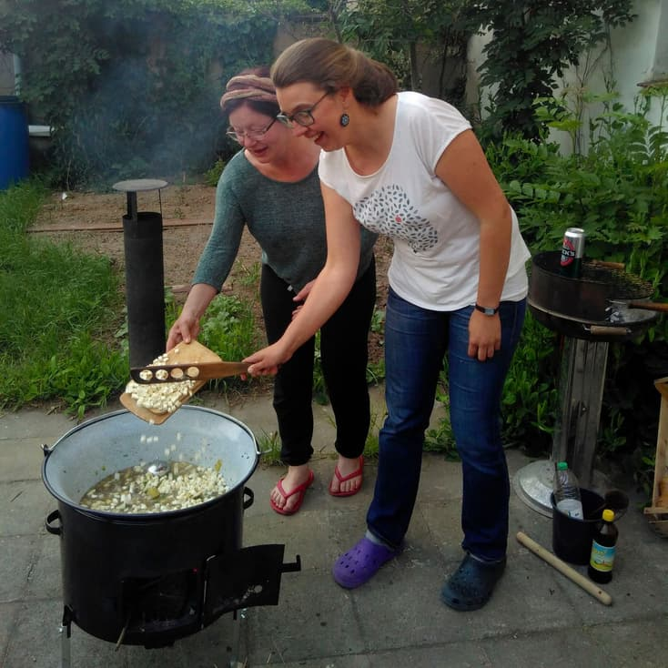

**The yunity heartbeat** - news from the world of sharing, fresh every month.

## [MOVE UTOPIA](https://move-utopia.de/)
MOVE is about to start! 
[Come and be part of it](https://move-utopia.de/en/anmeldung) from July 10 to 14 in Harzgerode!

In case you managed to not have heard about it before: It's the event of the year for (aspiring) activists of all kinds who want to create a world that provides a good life for everybody using a system that is based on skills and needs rather than on money and privilege. We will tackle the big questions and try and live as equals who treat each other with respect, even if we disagree. MOVE Utopia is a big playground, learning opportunity, networking hub, courageous experiment and conscious summer party all at the same time.

The [program is ready](https://move-utopia.de/de/infos/programm/programm.pdf) and comprises of 46 (!) pages of awesome workshops. Maybe you want to take the time to come up with a personalized time table for yourself in advance..? ;)

_by Janina_

## [Kanthaus](https://kanthaus.online)
The most notable change compared to last month is that Kanthaus now has **3** additional members! We are super happy that Nathalie, Thore and Clara feel so much connection and commitment towards Kanthaus that they chose to make this their main base for the months to come. :)

Another quite obvious innovation is our new logo! [This blog post](https://kanthaus.online/blog/2019-06-22_new-logo) describes the process of how we got it.

Event-wise June started with an [orga meeting](https://kanthaus.online/events/2019-05-31_fsde-festival-meeting) of the [foodsharing festival](https://www.foodsharing-festival.org) people. It took place in an otherwise quite empty Kanthaus and lead to a lot of community building among the team members. At the end of the month we also quite spontaneously hosted the very last [MOVE prep meeting](https://kanthaus.online/de/events/2019-06-24_move-meeting). On top of that we had Open Tuesdays every week, a foodsharing leftover brunch and a foodsharing Wurzen planning session.

 
_Thanks to the foodsharing festival meeting we had a disco soup during an Open Tuesday!_

[Last month](../2019-05-27) we had the topic of clutter, sorting and shelves and there has been steady progress ever since! Bodhi sorted the material storage in the basement and got rid of some things nobody needed. Nathalie sorted through a lot more things we were given for our free shop and extended the tidy free shop storage shelf. Tilmann and Janina built 8 more shelves for ~6 boxes each and started their plan to empty the room that right now is called 'the crap room'. Anja and Doug sorted the dragon room and freed a lot of space in there. Anja also sorted the dry food storage, the food storage in the basement and the drinks storage so that the new stuff that arrived from the foodsharing action at the Hurricane festival could be integrated much more easily.

_by Janina_

## [Foodsaving Worldwide](https://foodsaving.world)
The [foodsharing.de festival](https://www.foodsharing-festival.org) had claimed to be 'international' basically since it started five years ago. And even though it's true because of the involvement of Austria and Switzerland, it implies a bit more, doesn't it?

This year we want to make it _really_ international and host an international meetup for foodsavers from non-German-speaking communities. There is an [invitation on the forum](https://community.foodsaving.world/t/international-meetup-in-berlin-in-august/285) and we are already deep in the planning of the session itself. Looking forward to see as many of you there as possible! :D

_by Janina_

## [Karrot](https://karrot.world)

This June was quiet in terms of Karrot development, but some progress still was being made.

Bruno [proposed a sharing feature](https://community.foodsaving.world/t/sharing-feature/281) for Karrot, for encouraging users to share food and other things directly via Karrot.

I added an option to [export pickup feedback as CSV](https://community.foodsaving.world/t/statistics-about-the-amount-of-saved-food/85/27?u=tiltec). This will hopefully help groups to calculate detailed statistics that can't be found on Karrot yet.

Me and Janina added a button to the settings menu to unsubscribe from all notification emails from a group. This was possible before by clicking the "unsubscribe" option from the bottom of a notification email, but we thought it would be useful to have it in the settings menu, too.

Lastly, we are going to have [recurring calls about Karrot development](https://community.foodsaving.world/t/weekly-call-about-karrot-development/289) from now on. We invite interested users and potential developers to join the call and we will document meeting minutes publicly in the forum thread.

_by Tilmann_

## About the heartbeat.
The heartbeat is a monthly summary of what happens in yunity. It is meant to give an overview over our currents actions and topics.

### How to contribute?
Talk to us in [#heartbeat](https://yunity.slack.com/messages/heartbeat/) on [Slack](https://slackin.yunity.org) if you want to add content, change the layout or any other heartbeat related issues and ideas! We are also happy about any kind of feedback!
