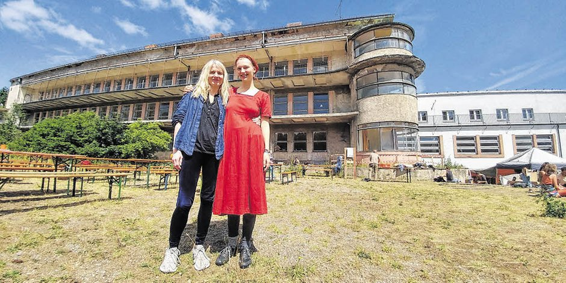

**The yunity heartbeat** - news from the world of sharing, fresh every month.

## [MOVE UTOPIA](https://move-utopia.de/)
The 2nd time now MOVE brought together around 1000 people interested in bringing about change. The 5 core days were filled with hundreds of workshops, seminars, discussions and encounters which were as diverse as the people taking part. The three topics 'work', 'property' and 'exchange logic' created a theoretical frame for the big question of 'How can we come closer to utopia?'. At the same time it became clear that the ideas of how this path to utopia actually looks like diverged between individuals and groups.

 
_Picture from MZ article about MOVE, by Steffen Könau_

Is it more important to change oneself to become a better, more grounded, authentic and loving person ('inner change')? Or should the focus lay on changing the external world; to overcome capitalism, to shut down the industries that pollute the planet, to help shift society away from racism, sexism, homophobia and all that crap ('outer change')? Or is it even possible and necessary to do both at the same time?

Do we think that boundless acceptance and understanding are the way, or do we feel the need to strongly say 'no!' in some cases? Can exclusion and coercion ever be acceptable and maybe even necessary or are they always to be condemned?

MOVE definitely surfaced some tension between different world views and managed to transform a lot of it into fruitful exchange. On the other side there was also conflict, frustration and exhaustion and the way this was dealt with was not perfect. Still, everybody tried their best to be fair, stay levelheaded and on topic. Next time there are hopefully more people taking on responsible roles not only in preparation but also during the event itself, because this year's orga team was under enormous stress until everything was over.

 

This leads to another point that was not ideal: MOVE was organized in a way that relied on everybody helping out. Nobody had to pay money for accommodation, food, drinks or education. This was only possible because all the work done in advance and during the event was done voluntarily by people like you and me. There was a shift system in place that allowed everybody to contribute. Unfortunately it was always the same people doing the work, many of which belonged to or were affiliated with the orga team.

These two examples show why there needs to be more MOVEs to come: There's _so_ much to learn and figure out together! How can we solve conflicts most productively? How can we overcome the consumer's mindset that today's world taught us so successfully? How can we truly emancipate ourselves, be free people and create the world that allows everybody to have a good life?s Let's come together again next year and do more steps into the direction of finding out! :)

_by Janina_

## [Foodsaving Worldwide](https://foodsaving.world)

We receive quite some mails again these days! There's people wanting to start foodsharing in Prague, South Tyrol, Mallorca, Bogota and Geneva and Luxembourg. The last two could luckily be connected to the existing groups and the first four hopefully find eager fellows soon! If you happen to be in one of those areas, please [get in contact](mailto:heartbeat@foodsaving.world)!

Also, the foodsharing festival in Berlin is drawing nearer and as you may know there will be an international meetup on Saturday August 17. We expect representatives from Italy, Poland, Sweden and of course Germany, Austria and Switzerland. If you too want to take part, please [get in contact](mailto:heartbeat@foodsaving.world) as well! ^\_^

_by Janina_

## [Kanthaus](https://kanthaus.online)
While many people had left for MOVE and Auerworld, Kanthaus was still only empty for a few days. Because from July 18 to 25 we hosted the [inventaire open data week](https://kanthaus.online/en/events/2019-07-18_inventaire-week). Not a lot of people participated, but those who did enjoyed a lot of talks about books, how to catalog them, the principles of [linked data](https://en.wikipedia.org/wiki/Linked_data) and some French pair programming.

Apart from that Kanthaus is still mostly in summer slumber. Some pieces of furniture get moved from A to B now and then, the garden grows nicely, people come and go between festivals, camps and congresses and recently we had a nice [warmshowers](https://www.warmshowers.org/) guest. Janina and Tilmann finished a new private room where before there was the crap room and due to the heat there are thoughts of creating a communal sleeping room where there is the silent office right now. Unfortunately that comes with quite the dependency chain, because for this to work the desk spaces would need to move to the dragon room, the sewing stuff from the dragon room would need to move to the sorting room, lots of things from the sorting room would need to go to the free shop storage - and that requires a lot of time spent on sorting. So maybe we'll just put some mattresses in the free shop for now, it's closed until September anyways... ;)

_by Janina_

## [Harzgerode](http://freiefeldlage.de/)

## [Karrot](https://karrot.world)

## About the heartbeat.
The heartbeat is a monthly summary of what happens in yunity. It is meant to give an overview over our currents actions and topics.

### How to contribute?
Talk to us in [#heartbeat](https://yunity.slack.com/messages/heartbeat/) on [Slack](https://slackin.yunity.org) if you want to add content, change the layout or any other heartbeat related issues and ideas! We are also happy about any kind of feedback!
