**The yunity heartbeat** - news from the world of sharing, fresh every month.

## [The foodsharing festival](https://www.foodsharing-festival.org/)
Almost tradition the foodsharing festival took place from 16th to 18th August for the 4th time in „Malzfabrik“, an old malt factory in the south of Berlin. Thanks to a beautiful location, pleasant weather and around 600 lovely people connected to the foodsharing movement, the idea of a foodsharing gathering became reality again.

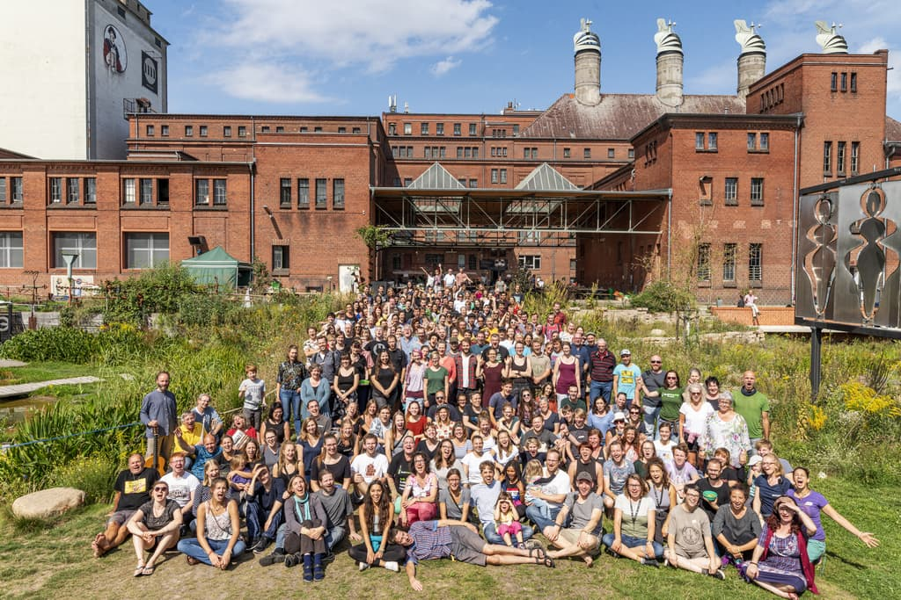 
_This year's group picture. Copyright: Luis Filippo Welz/Offenblen.de_

But what exactly is the idea behind the festival? You can either call it a summer party, a festival or a great get-together. Once a year people already active on foodsharing.de finally meet in person - in contrast to the sometimes challenging online communication. Foodsharers und foodsavers from different cities exchange ideas, experiences and connect. But that's not it: welcoming all kinds of people, who didn't necessarily hear about foodsharing before, creates a vibrant environment – best ground for discussions, finding new friends and opening up to wider topics in the context of sustainability. While the core topic is still food waste, it's inevitable to think about consumerism, environment, politics and finance as well.

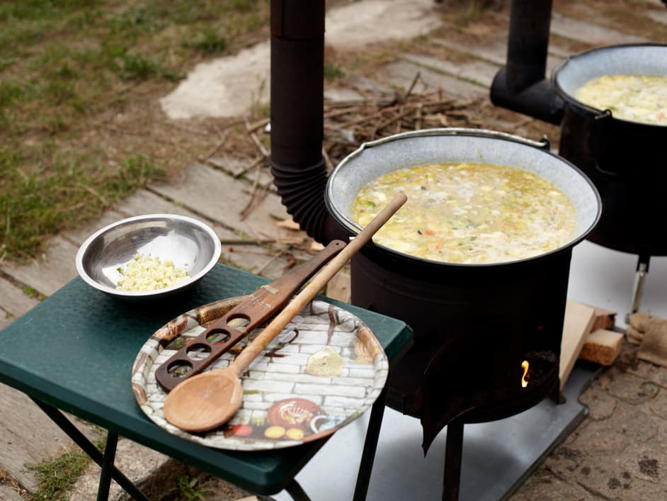 
_Two of the six small ovens that were used to cook for everybody. Copyright: Jens Kaesemann_

During day-time different workshops took place – from a panel discussion with guests from politics and industry to yoga. In the evening you could listen to live music. And in between many volunteers helped cooking and provided food for all visitors. As people differ so do the experiences how the festival was perceived: being in the orga team you mainly try to keep things running, belonging to the foodsharing board you see the opportunity to schedule a meeting, living in Berlin you come by for a few hours, discovering foodsharing you're keen on volunteering as much as possible between your favorite workshops. And that's the actual idea of the festival: coming together as a community.

_by Nathalie_

## [Utopival](https://ww.utopival.de)
Countdown for utopival has started and with that also final preparations.

A weekend ago almost the entire team came to Ganderkesee for some last days of laptop work and finalizing some thoughts, but also for good food and to enjoy the beautiful place where in less than a week the utopival will start.

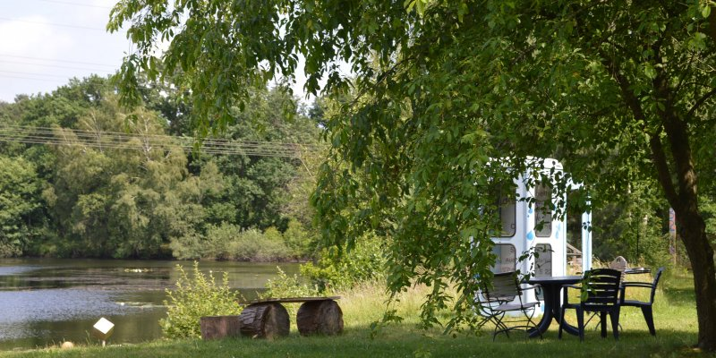 
_Just one pretty view of many on this beautiful site_

The first compost toilets, shower constructions and outdoor stoves were build during some building days and starting on Thursday there will be the final days of building up the camp.

Being at this beautiful place and starting to implement our visions and plans leads to us being able to imagine how beautiful utopival will be! We are so excited and almost impatient for it to begin!

_by findus_

## [Foodsaving Worldwide](https://foodsaving.world)
The foodsharing Festival in Berlin saw its very first really international meetup this year! We had a group from [Solikyl Gothenburg](http://solikyl.se/about/) (Sweden) and one from [Cucina Brigante Padua](https://www.facebook.com/CucinaBrigante/) (Italy), as well as individuals from different groups in Poland explicitly visiting the festival for this - and I was a little nervous how it would turn out to be.

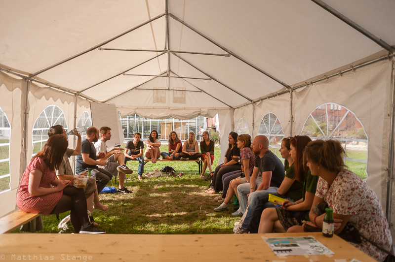 
_The meetup before the invited groups were even there! Copyright: Matthias Stange_

But it was great! There were a lot more people interested in the topic than I had thought and everybody made great use of this networking opportunity. We talked about common problems and how the different groups solved them, shared perceptions and experiences with the legal situation, the differentiation from classic charity work and how to set to food-share points. I really enjoyed seeing the different active people networking between and helping each other, and the best was when I heard that one guy from Padua spontaneously decided to travel to Gothenburg and deepen the connection between the two foodsaving groups! :)

_by Janina_

## [Auerworld festival](https://auerworld-festival.de/)
From July 26 to 28 the 19th edition of Auerworld was successfully held!
Without any need for emergency helicopters, without thunderstorms or catastrophes, roughly 1500 people had a great weekend.

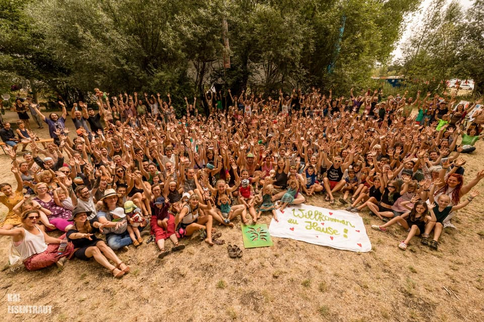 
_'Welcome home' says the sign in front_

In more than 50 workshops they discussed, reflected, learned from each other, shared ideas, got creative and moved their bodies. Many helping hands - including various [Workawayers](https://www.workaway.info/) - supported the team, helped move stuff into the new dry storage, establish waste separation on the whole festival and also making sure to dispose of it accordingly in the end.

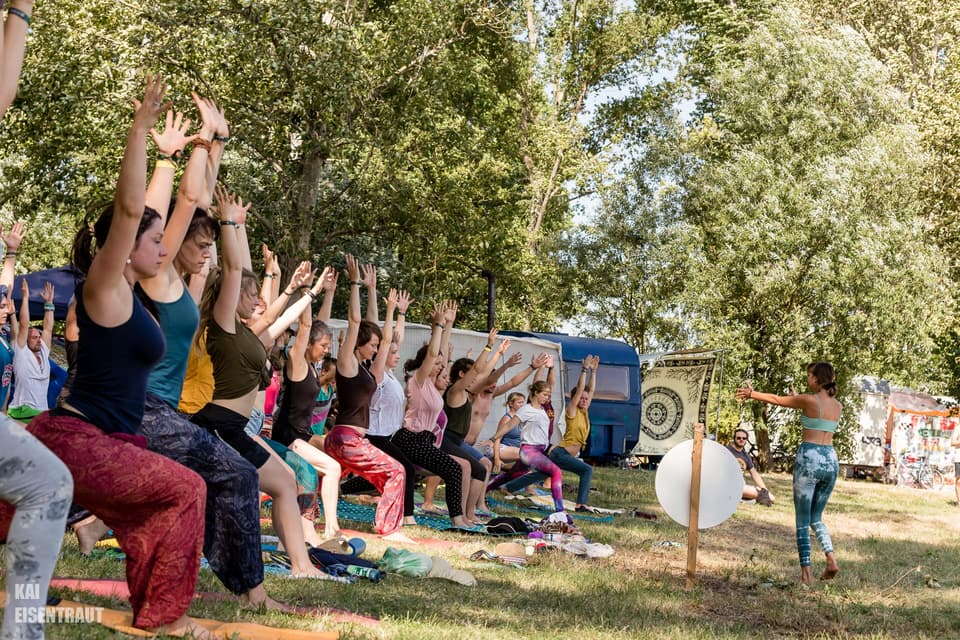 
_One of the many workshops_

There were several ideas that were tried out for the first time:
Following the wish of many guests we did not have a food stand selling meat this year. People who wanted to have it needed to leave the festival grounds and go to the nearby sports club house. And the first integrations of theater and poetry slam as new art forms on the festival were perceived very positively.

[Here](https://vimeo.com/352510122) you can watch the nicely made video to get a glimpse of the atmosphere at this year's Auerworld.

_by Silvan_

## [#block-vw](https://autofrei.noblogs.org/)
Okay, I understand that this might not obviously belong into a newsletter about sharing, so I will start with showing the relevance: All of us living creatures share this planet and homo sapiens is about to destroy it through pollution. When there's action being taken to stop that and to thus protect the common good that is the world we live in, I would say that it can very well count as an act of sharing or rather an act of enabling sharing in the future as well... 
And also there were some people from our bubble involved in this specific action so it had to be mentioned... ;)

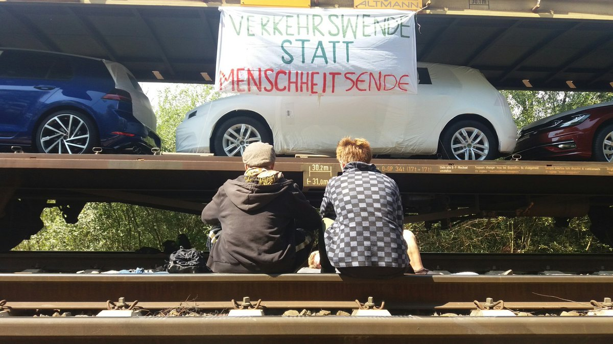 
_The banner says 'Transforming traffic instead of ending humanity'_

On August 13 multiple independent groups of climate activists blocked a train full of brand-new cars close to the Volkswagen factory in Wolfsburg. Some locked themselves onto the rails, some roped themselves down from the bridge the train was standing on and some even climbed a giant globe installation in the foyer of the nearby Volkswagen Autostadt (something in between an enterprise headquarters and a car-themed amusement park).

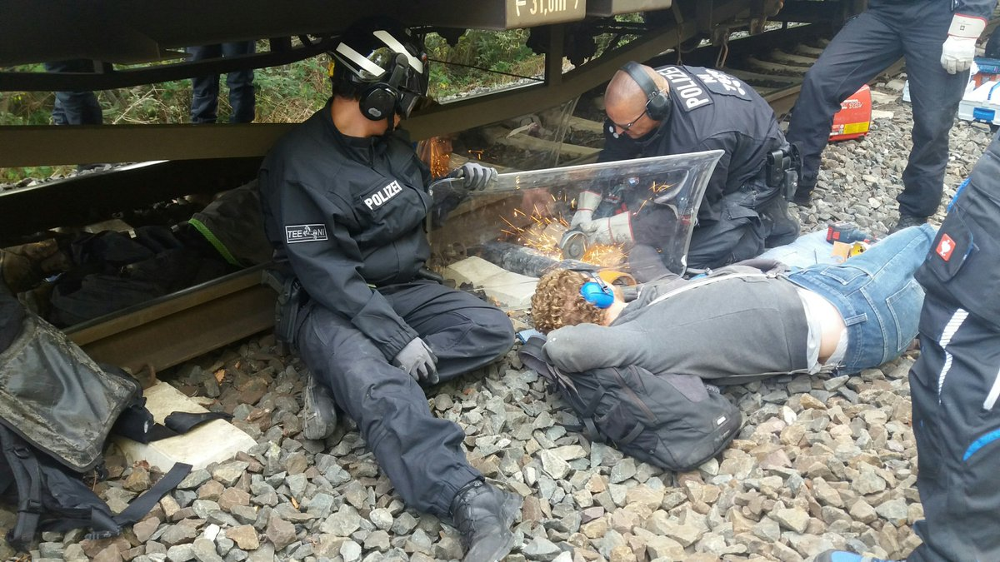 
_Forcing open the lock-ons required a whole collection of heavy tools..._

The action was meticulously planned and carefully carried out so that nobody was hurt and the train was blocked for almost a day. The people in the globe even stayed overnight and voluntarily left on the next day. Press coverage often employed the term 'spectacular' and was generally not awful (which is good in this case...). They understood the pioneer quality of this action which is the first to target the car industry as a main responsible for climate change. The demands were free public transport, more bike lanes, less focus on cars in general traffic. The topic is growing and this action definitely helped spread further.

_by Janina_

## Sacred Activism research week

The term Sacred Activism stands for the idea that in doing activism we are nature defending itself. That we as human beings are not disconnected but part of the earth and the ecosystem and with our actions we want to show which actions do harm to us.

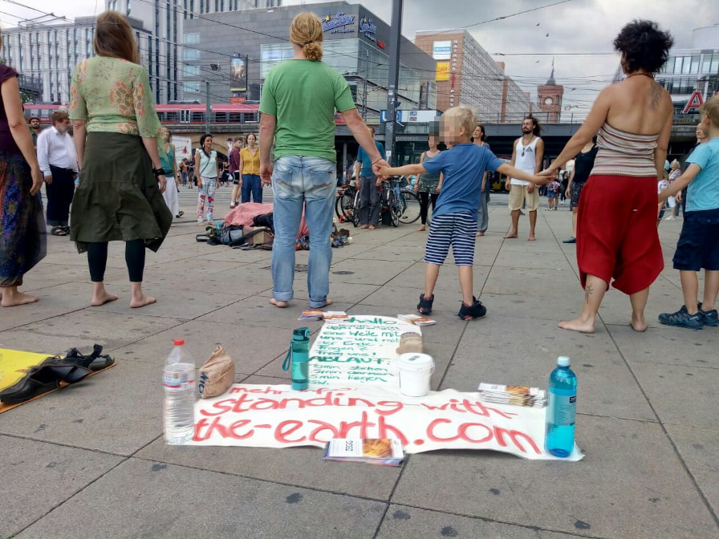 
_Participants of the research week standing with the Earth in Berlin_

Following a number of similar events like the [Rebels of Peace symposia](https://www.gemeinschaft-sulzbrunn.de/files/951/rebels-of-peace-sulzbrunn-symposia-10.pdf) and the [Defend the Sacred meeting in Tamera](https://www.tamera.org/events/defend-the-sacred-conference-for-global-change-makers-2/), the [Zegg community](https://www.zegg.de/en/) called for a networking and research week. Amongs them was I as part of the yunity network :-). 20 people who work on inner change and outer change came together to research how these two can be thought and lived together (a topic that was also very present at the MOVE Utopia - [you can read about that in the previous heartbeat](../2019-07-29)).

During this very intense time we were exploring how our fears that root in early childhood keep us from being connected with other people and the world. And how these fears also keep us from doing good in the world! Through a very impressive personal experience I was able to understand what this means to me personally and deeply combine my drive for outer change and my whish for inner work together. Very centrally I discovered that my fear of being alone and not loved that comes from being the oldest sibling and having to do stuff on my own too early is something real. I am learning to observe it in myself when this fear arises and consciously see it influence my mood. Then I have the possibility to act, voice this fear to others, do things which I know help me overcome this fear and in the long run learn how to use this fear as a tool for my life.

During this research week I found out how I can be a sustainable activist and how I can support others in sustaining their activism themselves. Some ideas: - take enough time to recover
- know your limits
- work on your fears
- accept that you are loved and very precious
- don't see yourself separated from anything, not from others not from the world

One concrete outcome was an action on Berlin Alexanderplatz, where 30 people were [standing with the earth](http://standing-with-the-earth.com/).

_by Laurina_

## [Kanthaus](https://kanthaus.online)
As you can see from the length of this heartbeat, lots of stuff are happening. This of course also means that not so much is happening in Kanthaus. The main exception being Tilmann building things which occasionally motivated others to join in. This time a new bed was created in the corridor - or rather above it - between the kitchen and the piano room. Another noteworthy development is that work on the hipster room floor started again and that we might soon be able to actually use it (after it has been a slightly forgotten construction site for one and a half years...)!

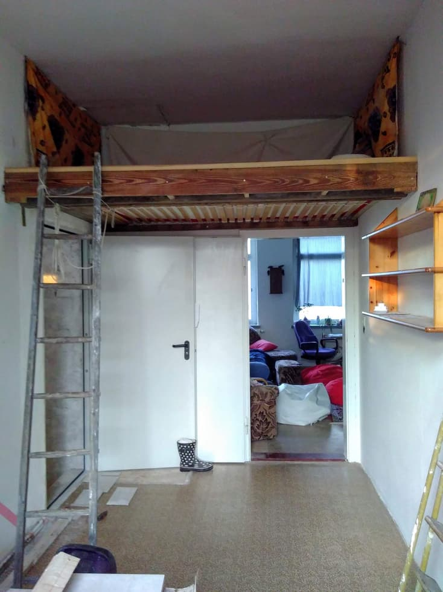 
_Look how cozy it is!_

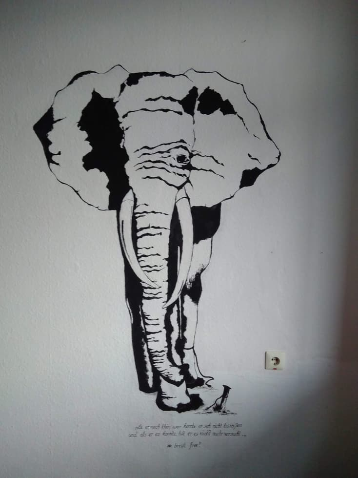 
_And findus added this awesome decoration!_

But there's also plans being reworked and processes being questioned. Just yesterday we had a meeting about the roadmap structure of quarterly meetings to coordinate work on the house. A week ago more room planning took place and went into directions never thought of. These meta talks are very helpful to improve the way we live together and the quality of care we provide for each other. Having a more coherent group allows us to plan bigger and to consider more drastic changes. Now we are working on adapting our structures to make that happen the best way possible.

_by Janina_

## About the heartbeat.
The heartbeat is a monthly summary of what happens in yunity. It is meant to give an overview over our currents actions and topics.

### How to contribute?
Talk to us in [#heartbeat](https://yunity.slack.com/messages/heartbeat/) on [Slack](https://slackin.yunity.org) if you want to add content, change the layout or any other heartbeat related issues and ideas! We are also happy about any kind of feedback!
