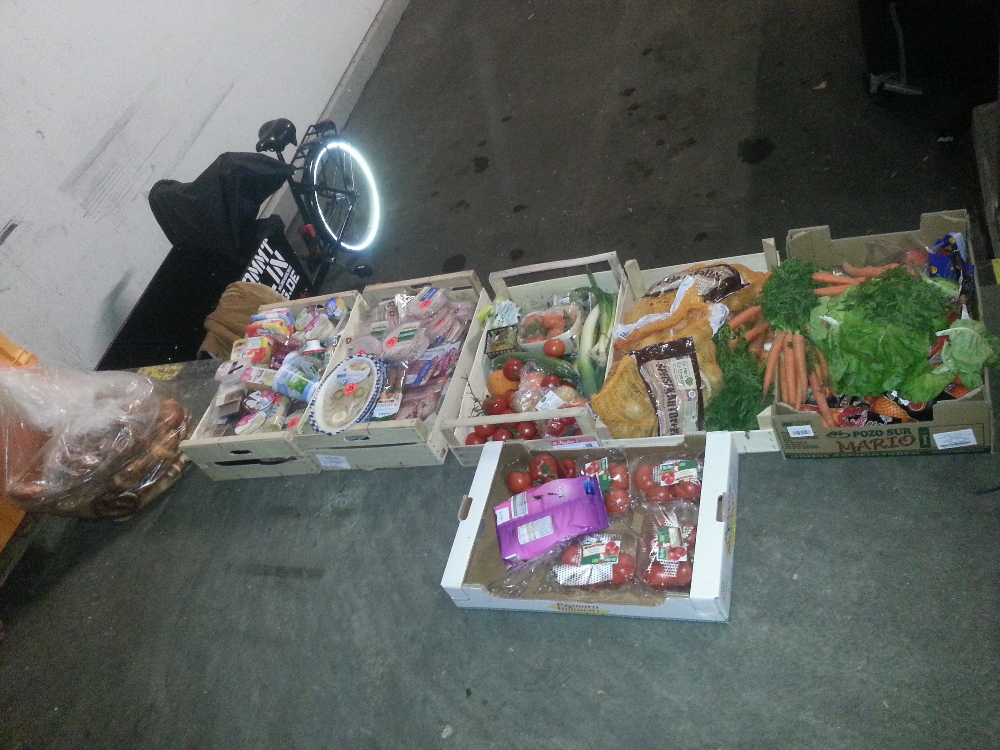
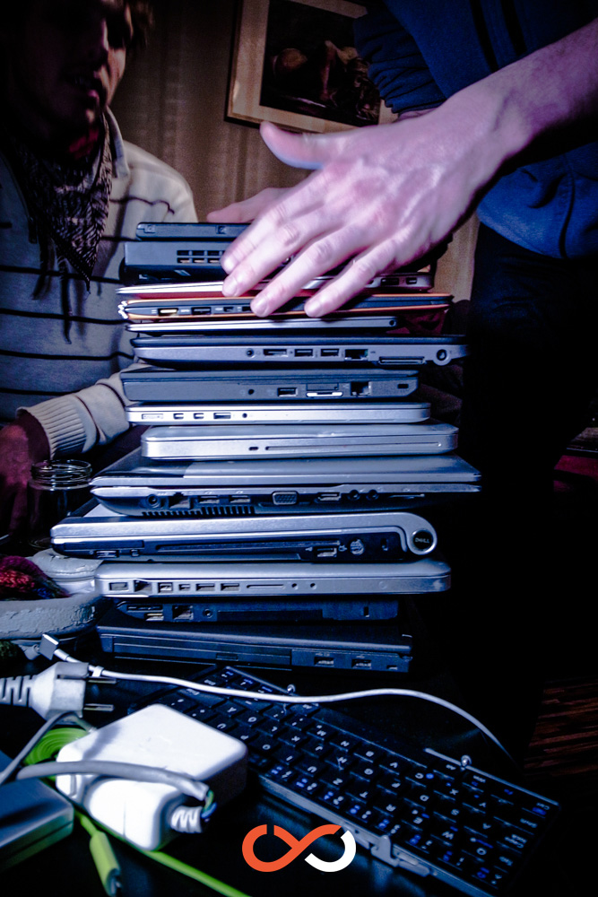

    

These two weeks of wupping went by very quickly! The setup was once again very different but the spirit was productive as always! This time we were hosted by two of our own members who both live in Nuremberg: Manuele provided his flat as a wupping and sleeping place and Kirstin provided hers as an additional working space. Although both locations were not very big, there was more than enough room to fit us all and at times it was really cozy!

While the first week was more about getting to know each other better and bonding, during the second week many of the core team members and new contributors arrived, so that we ended up with a group of 20 people again. Luckily we got hold of a third flat that we could use, so that everybody had a comfy place to sleep. We are convinced that as long as you believe in something, things always sort themselves out! Providing everybody with food was no issue at all, thanks to the local foodsharing community, [Fridolin](http://ibikenbg.de/), the local cargo bike free rental, and an amazing skill of some of our members to find rescuable resources everywhere and in incredible amounts!

Our growing project has so many tasks to be addressed that we sometimes had trouble choosing which one to handle first. That’s where the [Structure](https://yunity.atlassian.net/wiki/display/YUN/Structure+Team) Team’s work comes in, becoming more and more important and providing us with the tools and knowledge to collaborate in a non-hierarchical way. Also [PR](https://yunity.atlassian.net/wiki/display/YUN/PR+Team) and [Translation](https://yunity.atlassian.net/wiki/display/YUN/Translation+Team) were busy with newsletters, social-media, a manageable recruitment plan for more contributors, as well as taking care of subbing and spreading our finally finished [WuppDays #1 - How yunity began](https://www.youtube.com/watch?v=AzzD5uvlLqU) video - now available with English, French, German and Italian subtitles. On top of that, the most important part of our project - the actual product - got defined more clearly and the [Development](https://yunity.atlassian.net/wiki/display/YUN/Development+Team) and [Design](https://yunity.atlassian.net/wiki/display/YUN/Design+Team) Teams established an effective way of working together to better coordinate the process of creating an actually launchable application. Check out the current [specifications of the product](https://yunity.atlassian.net/wiki/display/YUN/Product+Team) in our ever growing [wiki](https://yunity.atlassian.net).

But apart from work, we also found the time to enjoy ourselves and celebrate our achievements, be it with Acroyoga, a LAN-party, one night out dancing or just enjoying the surprisingly warm sun in a beautiful Nuremberg park for a while.

Stay tuned for more WuppDays to be announced on our [event page](https://project.yunity.org/events), maybe next time near your place..?