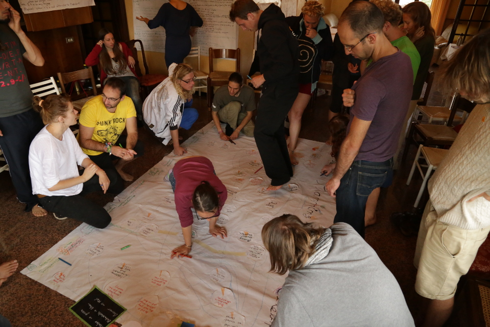
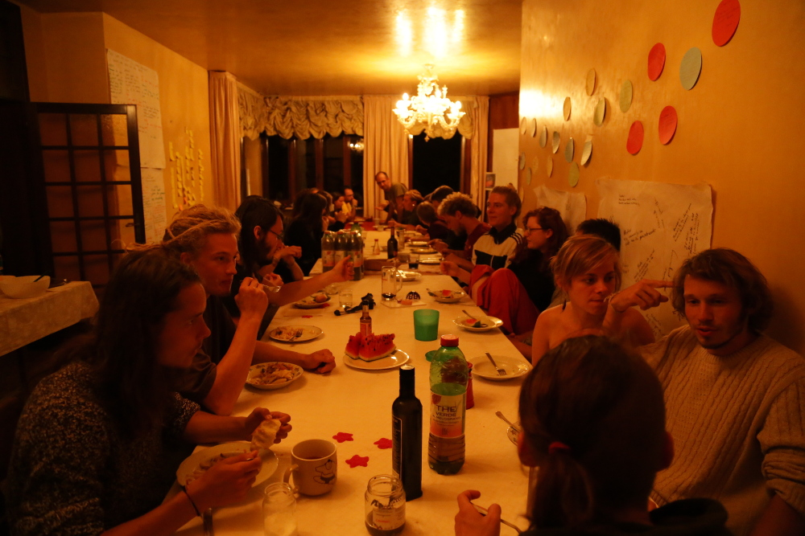

    

So WuppDays is 9 days in, let us tell you what we've been up to;

Upon arrival at Isabella’s wonderful house in Malo, we found Italy was more than we could have hoped for;with enough space for everyone to sleep, a lot of tasty food and a lot to think about, we are all incredibly thankful grazie mille Isabella! Futher more,  we are really grateful for the financial support received from [Armond](http://www.armond.com) which will help the project to run much more smoothly - grazie mille pure a Armond!

With most of the team in place it was incredible to realise that out of the 28 participants there were people from the USA, Germany, Italy, France, Estonia, Croatia, Scotland, England, Poland and Spain - several hitch-hiking over 1000 kms. Clearly the dream of the WuppDays had managed to attract passionate people from all over the world, and the assembled team wasn't even a tenth of those who applied. 

We spent the first two days together as part of the Dragon Dreaming process thanks to [Ulrike](http://www.emotionskultur.de/). This workshop helped us to think about the different phases of a successful project, such as Dreaming, Planning, Doing and Celebration.

---

With this process we were able to arrive at our mission and vision statements;

**Mission:**
<blockquote>We encourage relationships where people can share unconditionally their time, skills and resources. Through these connections and communities we prevent waste and raise awareness for a sustainable way of living.</blockquote>

**Vision:**
<blockquote>A society based on cooperation, trust and self-determination which allows people to live to their full potential and to preserve ecosystems for all living beings.</blockquote> 

---

A lot of delicious food has sustained us here! We saved food from local farmers, markets and organic stores, German sponsors and friends of Isabella - thank you all!

At the end of the first two days we slept deeply; designers talking to developers talking to visionaries talking to lawyers talking to organisers... Talking about our ideas and hopes to each other showed us we are all climbing the same mountain but also that we must work together, taking the same path. 

In the last days the IT Team got together, decided which language they wanted to code and organized themselves into groups and started coding. Even though 9 IT guys (yeah we are missing IT ladies ;-) are already setting up the foundation for a new way of sharing and saving, we are still looking for Designers and Programmers who want to participate in this unique ad-free and open-source project. Check out future development posts for more insights.
Besides IT people we are still looking for Translators and people who just want to stay tuned about the process, just sign up here: [wuppdays](http://project.yunity.org/join-the-team)  

Apart from the IT people we have a marvelous well being team that cooks, cleans, picks up food and organizes everything not related to IT development. For example, we are  shooting a film/documentary about the WuppDays, discussing the project strategy, making mockups, designing, researching existing sharing platform, taking care of legal issues, user needs, communicating and much more.

The atmosphere is very special and we feel wonderfully welcomed by Isabella and her family! We are grateful for this unique experience and for being surrounded by all this passion for the project! We'll keep you updated.

All our love from us here at Malo