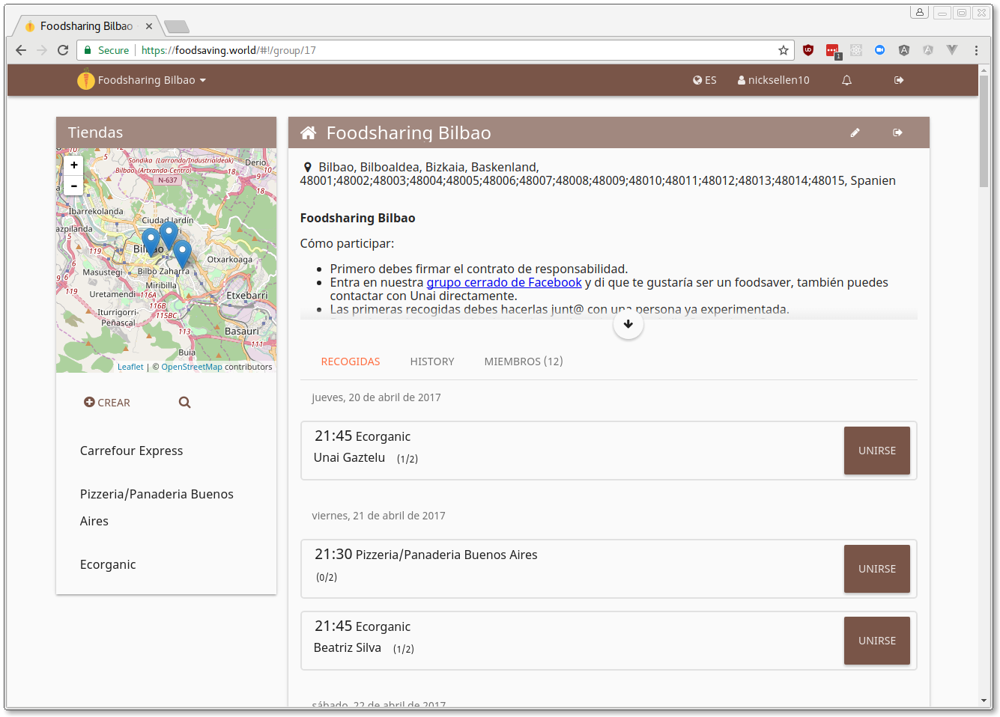

# Karrot

> A modern website for organization of foodsaving groups worldwide

* Public website: [foodsaving.world](https://foodsaving.world/?target=_blank)
* Blog: [blog.foodsaving.world](https://blog.foodsaving.world/?target=_blank)
* Test website:
[dev.foodsaving.world](https://dev.foodsaving.world/?target=_blank)
* Frontend code: [github.com/yunity/karrot-frontend](https://github.com/yunity/karrot-frontend?target=_blank)
* Backend code: [github.com/yunity/karrot-backend](https://github.com/yunity/karrot-backend?target=_blank)
