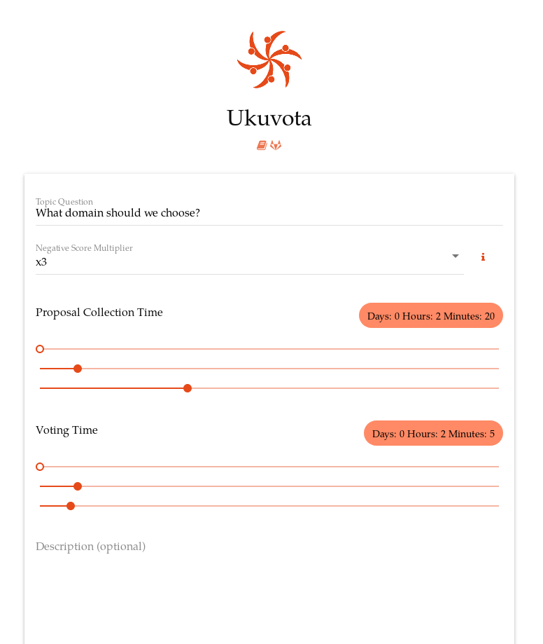

# Ukuvota

> Ukuvota is a voting tool for decision making processes to become easier and quicker, this tool uses weighted score voting with consensus logic to create a strategic method of finding the best decision with a low resistance!

* Code: [https://gitlab.com/ukuvota](https://gitlab.com/ukuvota?target=_blank)
