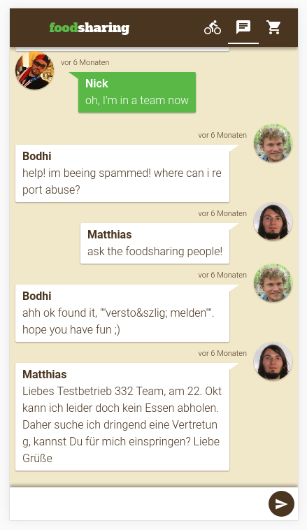

# foodsharing.de Development

> We maintain and continue development of [foodsharing.de](https://foodsharing.de?target=_blank)

* Public website: [foodsharing.de](https://foodsharing.de/?target=_blank)
* Gitlab group: [gitlab.com/foodsharing-dev](https://gitlab.com/foodsharing-dev?target=_blank)
* Developer blog: [devblog.foodsharing.de](https://devblog.foodsharing.de?target=_blank)

We are also working on a new lightweight tool:

* Github organisation: [github.com/foodsharing-dev](https://github.com/foodsharing-dev?target=_blank)

